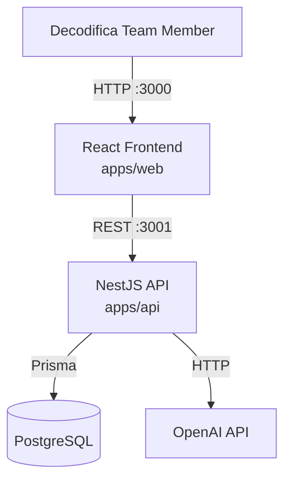
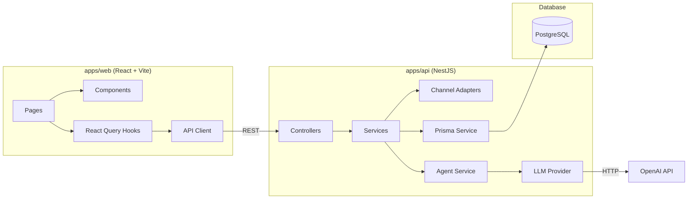
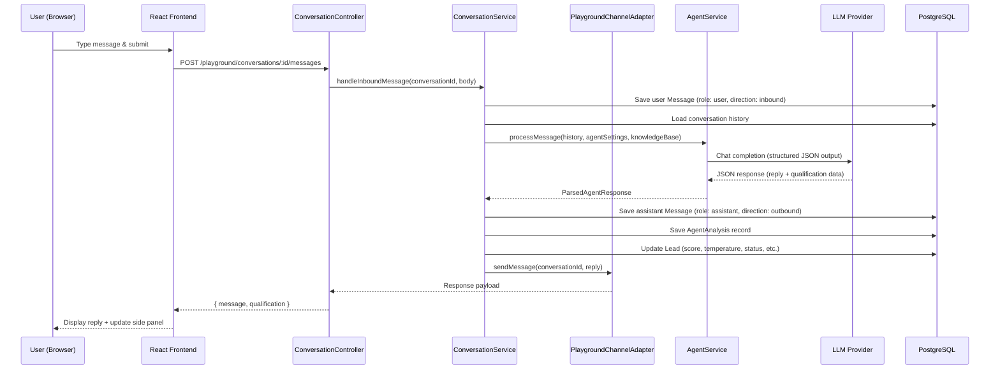
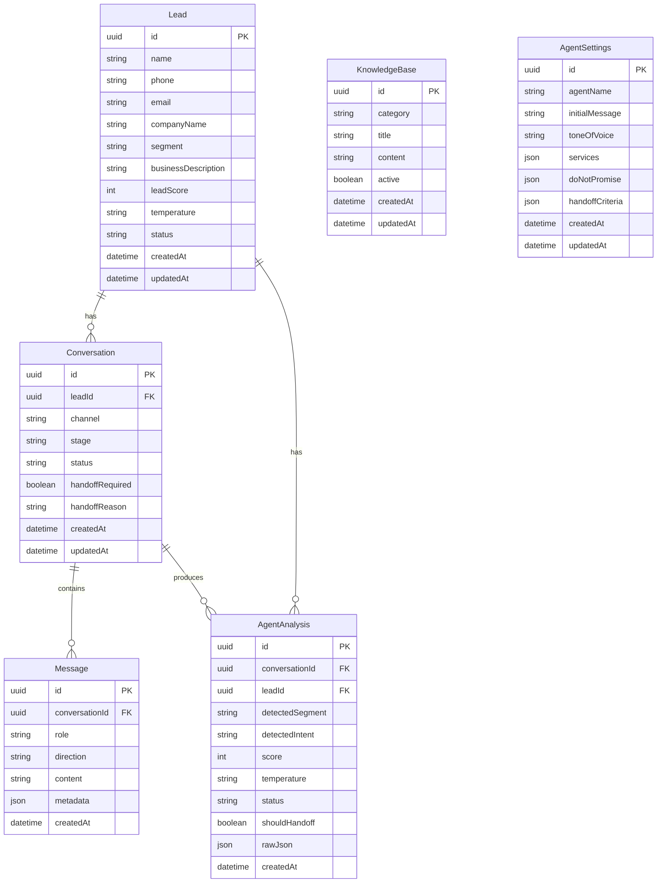
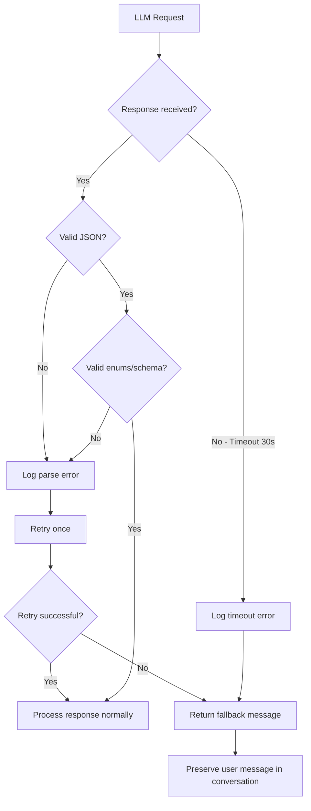

# Design Document

## Overview

Assistente Decodifica Playground is a monorepo application composed of a NestJS API backend (`apps/api`) and a React + Vite frontend (`apps/web`). The system simulates AI-powered WhatsApp conversations for lead qualification, using a channel adapter pattern to decouple core agent logic from the communication transport.

The architecture prioritizes:
- **Separation of concerns**: Channel adapters isolate transport from business logic
- **Structured LLM output**: JSON schema enforcement ensures reliable data extraction
- **Real-time qualification**: Side panel updates immediately from LLM structured responses
- **Future extensibility**: Evolution API adapter stub ready for WhatsApp integration

### Key Design Decisions

| Decision | Rationale |
|----------|-----------|
| Monorepo with `apps/api` + `apps/web` | Shared types, single Docker Compose, unified CI |
| NestJS modules per domain | Clean boundaries: conversation, lead, knowledge, agent, channel |
| Prisma ORM | Type-safe queries, migration management, PostgreSQL support |
| Channel adapter interface | Swap playground ↔ WhatsApp without touching agent logic |
| LLM structured output via JSON schema | Reliable field extraction, retry on parse failure |
| React Query for server state | Automatic cache invalidation, optimistic updates |
| Tailwind CSS dark theme | Consistent design tokens, no CSS-in-JS overhead |

## Architecture

### System Context Diagram



### High-Level Module Architecture



### Request Flow: Message Exchange



## Components and Interfaces

### Backend Module Structure (`apps/api/src`)

```
apps/api/src/
├── main.ts
├── app.module.ts
├── config/
│   ├── config.module.ts
│   ├── config.service.ts          # Validates env vars at startup
│   └── config.schema.ts           # Joi/class-validator schema
├── prisma/
│   ├── prisma.module.ts
│   ├── prisma.service.ts
│   └── schema.prisma
├── channel/
│   ├── channel.module.ts
│   ├── channel-adapter.interface.ts
│   ├── playground-channel.adapter.ts
│   └── evolution-channel.adapter.ts  # Stub
├── agent/
│   ├── agent.module.ts
│   ├── agent.service.ts            # Orchestrates LLM calls
│   ├── prompt-builder.service.ts   # Constructs system prompt
│   ├── response-parser.service.ts  # Validates/parses JSON response
│   └── dto/
│       ├── agent-response.dto.ts
│       └── agent-settings.dto.ts
├── llm/
│   ├── llm.module.ts
│   ├── llm-provider.interface.ts
│   ├── openai-provider.service.ts
│   └── llm-provider.factory.ts    # Factory based on LLM_PROVIDER env
├── conversation/
│   ├── conversation.module.ts
│   ├── conversation.controller.ts
│   ├── conversation.service.ts
│   └── dto/
│       ├── create-conversation.dto.ts
│       └── send-message.dto.ts
├── lead/
│   ├── lead.module.ts
│   ├── lead.controller.ts
│   ├── lead.service.ts
│   └── dto/
│       ├── update-lead-status.dto.ts
│       └── lead-filter.dto.ts
├── dashboard/
│   ├── dashboard.module.ts
│   ├── dashboard.controller.ts
│   └── dashboard.service.ts
├── knowledge/
│   ├── knowledge.module.ts
│   ├── knowledge.controller.ts
│   ├── knowledge.service.ts
│   └── dto/
│       ├── create-knowledge.dto.ts
│       └── update-knowledge.dto.ts
└── settings/
    ├── settings.module.ts
    ├── settings.controller.ts
    ├── settings.service.ts
    └── dto/
        └── update-settings.dto.ts
```

### Frontend Structure (`apps/web/src`)

```
apps/web/src/
├── main.tsx
├── App.tsx
├── api/
│   └── client.ts                  # Axios instance + endpoints
├── hooks/
│   ├── useConversation.ts
│   ├── useLeads.ts
│   ├── useDashboard.ts
│   ├── useKnowledge.ts
│   └── useSettings.ts
├── pages/
│   ├── PlaygroundPage.tsx
│   ├── DashboardPage.tsx
│   ├── LeadDetailPage.tsx
│   └── SettingsPage.tsx
├── components/
│   ├── layout/
│   │   ├── Sidebar.tsx
│   │   └── PageLayout.tsx
│   ├── playground/
│   │   ├── ChatPanel.tsx
│   │   ├── MessageBubble.tsx
│   │   ├── ChatInput.tsx
│   │   └── QualificationPanel.tsx
│   ├── dashboard/
│   │   ├── SummaryCards.tsx
│   │   └── LeadsTable.tsx
│   ├── leads/
│   │   ├── LeadInfo.tsx
│   │   ├── ConversationHistory.tsx
│   │   └── QualificationSummary.tsx
│   ├── knowledge/
│   │   ├── KnowledgeList.tsx
│   │   └── KnowledgeForm.tsx
│   ├── settings/
│   │   └── AgentSettingsForm.tsx
│   └── ui/
│       ├── Button.tsx
│       ├── Card.tsx
│       ├── Badge.tsx
│       ├── Input.tsx
│       ├── Table.tsx
│       └── Pagination.tsx
├── types/
│   └── index.ts                   # Shared TypeScript interfaces
└── lib/
    └── utils.ts                   # Tailwind merge, formatters
```

### Key Interfaces

#### Channel Adapter Interface

```typescript
// apps/api/src/channel/channel-adapter.interface.ts

export interface InboundMessage {
  conversationId: string;
  content: string;
  senderIdentifier: string; // phone or session ID
  metadata?: Record<string, unknown>;
}

export interface ChannelAdapter {
  /**
   * Send a message to the client through this channel.
   */
  sendMessage(to: string, message: string): Promise<void>;

  /**
   * Parse an inbound payload into a normalized InboundMessage.
   */
  receiveMessage(payload: unknown): Promise<InboundMessage>;
}
```

#### LLM Provider Interface

```typescript
// apps/api/src/llm/llm-provider.interface.ts

export interface LLMCompletionRequest {
  messages: Array<{ role: 'system' | 'user' | 'assistant'; content: string }>;
  temperature?: number;
  maxTokens?: number;
  responseFormat?: 'json';
}

export interface LLMCompletionResponse {
  content: string;
  usage: { promptTokens: number; completionTokens: number; totalTokens: number };
  model: string;
}

export interface LLMProvider {
  complete(request: LLMCompletionRequest): Promise<LLMCompletionResponse>;
}
```

#### Agent Response DTO

```typescript
// apps/api/src/agent/dto/agent-response.dto.ts

export interface AgentResponse {
  reply: string;
  stage: ConversationStage;
  detectedSegment: string | null;
  businessDescription: string | null;
  detectedIntent: DetectedIntent;
  whatsappUsage: string | null;
  mainPain: string | null;
  secondaryPains: string[];
  desiredOutcome: string | null;
  estimatedVolume: VolumeLevel;
  urgency: UrgencyLevel;
  decisionRole: DecisionRole;
  budgetSignal: BudgetSignal;
  objections: string[];
  recommendedService: string | null;
  leadScore: number;
  scoreReasons: string[];
  temperature: Temperature;
  status: LeadStatus;
  shouldHandoff: boolean;
  handoffReason: string | null;
  commercialSummary: string | null;
  nextBestQuestion: string | null;
}

export type ConversationStage =
  | 'abertura' | 'descoberta' | 'diagnostico'
  | 'explicacao_solucao' | 'tratamento_objecao'
  | 'conversao' | 'handoff_humano';

export type DetectedIntent =
  | 'vendas' | 'suporte' | 'agendamento' | 'duvidas'
  | 'orcamento' | 'integracao' | 'curiosidade' | 'outro';

export type VolumeLevel = 'baixo' | 'medio' | 'alto' | 'desconhecido';
export type UrgencyLevel = 'baixa' | 'media' | 'alta' | 'desconhecida';
export type DecisionRole = 'dono' | 'gestor' | 'funcionario' | 'desconhecido';
export type BudgetSignal = 'baixo' | 'medio' | 'alto' | 'desconhecido';
export type Temperature = 'frio' | 'morno' | 'quente';
export type LeadStatus =
  | 'novo' | 'qualificando' | 'frio' | 'morno' | 'quente'
  | 'chamar_humano' | 'convertido' | 'perdido';
```

### Service Responsibilities

| Service | Responsibility |
|---------|---------------|
| `ConfigService` | Validates environment variables at startup, exposes typed config |
| `ConversationService` | Creates conversations, orchestrates message flow, manages state |
| `AgentService` | Builds prompts, calls LLM, parses responses, handles retries |
| `PromptBuilderService` | Constructs system prompt from settings + knowledge base + history |
| `ResponseParserService` | Validates JSON structure, enforces enum constraints |
| `LeadService` | CRUD for leads, status updates, qualification data persistence |
| `DashboardService` | Aggregation queries for summary statistics |
| `KnowledgeService` | CRUD for knowledge base items, active filtering |
| `SettingsService` | Persists and retrieves agent configuration |
| `LLMProviderFactory` | Creates appropriate LLM provider based on env config |
| `OpenAIProviderService` | Implements LLMProvider for OpenAI API |
| `PlaygroundChannelAdapter` | Routes messages to/from web playground |
| `EvolutionChannelAdapter` | Stub for future WhatsApp integration |

## Data Models

### Prisma Schema

```prisma
// apps/api/prisma/schema.prisma

generator client {
  provider = "prisma-client-js"
}

datasource db {
  provider = "postgresql"
  url      = env("DATABASE_URL")
}

model Lead {
  id                  String    @id @default(uuid()) @db.Uuid
  name                String    @db.VarChar(200)
  phone               String    @db.VarChar(20)
  email               String?   @db.VarChar(254)
  companyName         String?   @db.VarChar(200) @map("company_name")
  segment             String?   @db.VarChar(100)
  businessDescription String?   @db.VarChar(2000) @map("business_description")
  whatsappUsage       String?   @db.VarChar(500) @map("whatsapp_usage")
  mainPain            String?   @db.VarChar(1000) @map("main_pain")
  secondaryPains      Json?     @map("secondary_pains") @db.JsonB
  desiredOutcome      String?   @db.VarChar(1000) @map("desired_outcome")
  estimatedVolume     String?   @db.VarChar(100) @map("estimated_volume")
  urgency             String?   @db.VarChar(50)
  decisionRole        String?   @db.VarChar(100) @map("decision_role")
  budgetSignal        String?   @db.VarChar(500) @map("budget_signal")
  objections          Json?     @db.JsonB
  recommendedService  String?   @db.VarChar(200) @map("recommended_service")
  leadScore           Int?      @map("lead_score") @db.SmallInt
  temperature         String?   @db.VarChar(20)
  status              String    @db.VarChar(50)
  summary             String?   @db.VarChar(5000)
  nextStep            String?   @db.VarChar(1000) @map("next_step")
  createdAt           DateTime  @default(now()) @map("created_at")
  updatedAt           DateTime  @updatedAt @map("updated_at")

  conversations       Conversation[]
  agentAnalyses       AgentAnalysis[]

  @@map("leads")
}

model Conversation {
  id              String    @id @default(uuid()) @db.Uuid
  leadId          String    @map("lead_id") @db.Uuid
  channel         String    @db.VarChar(50)
  stage           String    @db.VarChar(50)
  status          String    @db.VarChar(50)
  lastIntent      String?   @db.VarChar(100) @map("last_intent")
  handoffRequired Boolean   @default(false) @map("handoff_required")
  handoffReason   String?   @db.VarChar(500) @map("handoff_reason")
  createdAt       DateTime  @default(now()) @map("created_at")
  updatedAt       DateTime  @updatedAt @map("updated_at")

  lead            Lead      @relation(fields: [leadId], references: [id])
  messages        Message[]
  agentAnalyses   AgentAnalysis[]

  @@map("conversations")
}

model Message {
  id              String    @id @default(uuid()) @db.Uuid
  conversationId  String    @map("conversation_id") @db.Uuid
  role            String    @db.VarChar(50)
  direction       String    @db.VarChar(20)
  content         String    @db.VarChar(10000)
  metadata        Json?     @db.JsonB
  createdAt       DateTime  @default(now()) @map("created_at")

  conversation    Conversation @relation(fields: [conversationId], references: [id])

  @@map("messages")
}

model AgentAnalysis {
  id                String    @id @default(uuid()) @db.Uuid
  conversationId    String    @map("conversation_id") @db.Uuid
  leadId            String    @map("lead_id") @db.Uuid
  detectedSegment   String?   @db.VarChar(100) @map("detected_segment")
  detectedIntent    String?   @db.VarChar(100) @map("detected_intent")
  mainPain          String?   @db.VarChar(1000) @map("main_pain")
  recommendedService String?  @db.VarChar(200) @map("recommended_service")
  score             Int?      @db.SmallInt
  temperature       String?   @db.VarChar(20)
  status            String?   @db.VarChar(50)
  shouldHandoff     Boolean?  @map("should_handoff")
  handoffReason     String?   @db.VarChar(500) @map("handoff_reason")
  commercialSummary String?   @db.VarChar(5000) @map("commercial_summary")
  nextBestQuestion  String?   @db.VarChar(1000) @map("next_best_question")
  scoreReasons      Json?     @map("score_reasons") @db.JsonB
  rawJson           Json?     @map("raw_json") @db.JsonB
  createdAt         DateTime  @default(now()) @map("created_at")

  conversation      Conversation @relation(fields: [conversationId], references: [id])
  lead              Lead         @relation(fields: [leadId], references: [id])

  @@map("agent_analyses")
}

model KnowledgeBase {
  id        String    @id @default(uuid()) @db.Uuid
  category  String    @db.VarChar(50)
  title     String    @db.VarChar(100)
  content   String    @db.VarChar(5000)
  active    Boolean   @default(true)
  createdAt DateTime  @default(now()) @map("created_at")
  updatedAt DateTime  @updatedAt @map("updated_at")

  @@map("knowledge_base")
}

model AgentSettings {
  id              String    @id @default(uuid()) @db.Uuid
  agentName       String    @db.VarChar(100) @map("agent_name")
  initialMessage  String    @db.VarChar(500) @map("initial_message")
  toneOfVoice     String?   @db.VarChar(300) @map("tone_of_voice")
  services        Json?     @db.JsonB  // string[] max 20 items
  doNotPromise    Json?     @db.JsonB @map("do_not_promise")  // string[] max 20 items
  handoffCriteria Json?     @db.JsonB @map("handoff_criteria")  // string[] max 10 items
  createdAt       DateTime  @default(now()) @map("created_at")
  updatedAt       DateTime  @updatedAt @map("updated_at")

  @@map("agent_settings")
}
```

### Entity Relationship Diagram




## Correctness Properties

*A property is a characteristic or behavior that should hold true across all valid executions of a system — essentially, a formal statement about what the system should do. Properties serve as the bridge between human-readable specifications and machine-verifiable correctness guarantees.*

### Property 1: Message length validation

*For any* string input submitted as a message, the system SHALL accept it if and only if its length is between 1 and 4000 characters (inclusive). Strings of length 0 or greater than 4000 SHALL be rejected with a validation error, and the conversation state SHALL remain unchanged.

**Validates: Requirements 2.1, 2.2**

### Property 2: Agent response JSON schema validation (round-trip)

*For any* valid AgentResponse object conforming to the defined schema (all required fields present, enums within allowed sets, arrays within size limits), serializing to JSON and parsing back through the ResponseParserService SHALL produce an equivalent object. Conversely, for any JSON object missing required fields or containing invalid enum values, the parser SHALL reject it.

**Validates: Requirements 4.1**

### Property 3: Agent response single question constraint

*For any* agent reply string returned by the LLM, the text SHALL contain exactly one question (sentence ending with "?"). Zero questions or more than one question SHALL be flagged as a constraint violation.

**Validates: Requirements 3.2**

### Property 4: Agent reply length constraint

*For any* agent reply string, when the closing question (last sentence ending with "?") is excluded, the remaining text SHALL be at most 300 characters in length.

**Validates: Requirements 3.3**

### Property 5: No emoji and no repeated filler words

*For any* single agent reply, the text SHALL contain zero emoji characters (Unicode emoji ranges). *For any* window of 5 consecutive agent replies in a conversation, no filler expression (from the defined set: "Show", "Legal demais", "Perfeito", "Ok", "Entendi") SHALL appear more than once.

**Validates: Requirements 3.4**

### Property 6: Conversation stage progression invariant

*For any* sequence of conversation stage transitions within a single conversation, stages SHALL only advance forward through the defined order (abertura → descoberta → diagnostico → explicacao_solucao → tratamento_objecao → conversao → handoff_humano) or remain at the current stage. No stage SHALL be skipped or regressed, except that any stage may transition directly to handoff_humano.

**Validates: Requirements 3.5**

### Property 7: Handoff reason validation

*For any* AgentResponse where shouldHandoff is true, the handoffReason field SHALL be a non-empty string with length between 10 and 500 characters (inclusive).

**Validates: Requirements 4.5, 7.6**

### Property 8: AgentResponse to database mapping

*For any* valid AgentResponse returned by the LLM, the system SHALL persist an AgentAnalysis record containing all mapped fields (detectedSegment, detectedIntent, mainPain, recommendedService, score, temperature, status, shouldHandoff, handoffReason, commercialSummary, nextBestQuestion, scoreReasons, rawJson) AND update the Lead record with the latest score, temperature, status, segment, mainPain, recommendedService, and objections.

**Validates: Requirements 5.2, 5.3**

### Property 9: Null field retention

*For any* AgentResponse containing null or empty values for qualification fields, the system SHALL retain the previously stored values for those fields in both the Lead record and the qualification panel display. Only non-null values SHALL overwrite existing data.

**Validates: Requirements 5.4**

### Property 10: Scoring criteria increment

*For any* scoring criterion (business identified: +15, WhatsApp usage: +15, pain point: +20, volume/impact: +15, urgency/intent: +10, decision-maker: +10, accepts diagnosis: +15) that is met for the first time in a conversation, the Lead_Score SHALL increase by exactly the defined amount, and a corresponding entry SHALL be added to the scoreReasons array.

**Validates: Requirements 6.1, 6.2, 6.3, 6.4, 6.5, 6.6, 6.7**

### Property 11: Temperature classification

*For any* Lead_Score value in [0, 100], the temperature SHALL be classified as: "frio" if score is in [0, 39], "morno" if score is in [40, 69], "quente" if score is in [70, 100]. The classification SHALL be exhaustive and mutually exclusive.

**Validates: Requirements 6.9, 6.10, 6.11**

### Property 12: Scoring idempotence

*For any* conversation, each scoring criterion (criteria 6.1-6.7) SHALL be counted at most once. If the same criterion is triggered multiple times across different messages, the score SHALL not increase again for that criterion.

**Validates: Requirements 6.12**

### Property 13: Score cap at 100

*For any* combination of scoring criteria applied to a Lead, the final Lead_Score SHALL never exceed 100. If the sum of all triggered criteria exceeds 100, the score SHALL be capped at 100.

**Validates: Requirements 6.13**

### Property 14: Handoff threshold trigger

*For any* Lead with a Lead_Score of 70 or above, the system SHALL set shouldHandoff to true in the next agent response.

**Validates: Requirements 7.1**

### Property 15: Pagination and ordering

*For any* set of leads returned by the paginated list endpoint, each page SHALL contain at most 20 items, and items SHALL be sorted by most recent date first (descending createdAt/updatedAt). *For any* set of messages in a conversation, they SHALL be returned in chronological order (ascending createdAt).

**Validates: Requirements 8.2, 9.2**

### Property 16: Lead detail null field display

*For any* Lead object with any combination of null and non-null fields, the detail view SHALL display the actual value for non-null fields and a placeholder label (e.g., "Not informed") for null/empty fields. No field SHALL be omitted from the display.

**Validates: Requirements 9.1**

### Property 17: Most recent analysis display

*For any* set of AgentAnalysis records associated with a lead, the detail view SHALL display qualification data from the record with the most recent createdAt timestamp.

**Validates: Requirements 9.3**

### Property 18: Knowledge base grouping by category

*For any* set of KnowledgeBase items, the list display SHALL group items by their category field, with all items sharing the same category appearing together in the same group.

**Validates: Requirements 10.1**

### Property 19: Required field validation

*For any* request body (KnowledgeBase create/edit, AgentSettings save, or any POST/PATCH endpoint) where one or more required fields are empty or missing, the system SHALL reject the request with a 422 status code and a response indicating which fields failed validation. The underlying data SHALL remain unchanged.

**Validates: Requirements 10.6, 11.4, 16.12**

### Property 20: Referential integrity enforcement

*For any* record creation that includes a foreign key reference (Message.conversationId, Conversation.leadId, AgentAnalysis.conversationId, AgentAnalysis.leadId), if the referenced parent record does not exist, the system SHALL reject the operation and return an error.

**Validates: Requirements 12.5**

### Property 21: updatedAt timestamp invariant

*For any* modification to a Lead or Conversation record field, the updatedAt timestamp SHALL be updated to a value greater than or equal to the previous updatedAt value.

**Validates: Requirements 12.6**

### Property 22: Non-existent resource returns 404

*For any* GET, PATCH, or DELETE request referencing a resource ID (UUID) that does not exist in the database, the API SHALL return a 404 status code with a JSON error response.

**Validates: Requirements 16.11**

## Error Handling

### Error Categories and Responses

| Error Type | HTTP Status | User-Facing Message | System Action |
|-----------|-------------|---------------------|---------------|
| Validation failure | 422 | Field-specific error messages | Reject request, no state change |
| Resource not found | 404 | "Resource not found" | Return error response |
| LLM timeout (30s) | 503 | "Agent temporarily unavailable" | Log error, preserve user message |
| LLM invalid JSON | — | (retry silently) | Retry once within 10s, log error |
| LLM retry failure | 503 | "Agent temporarily unavailable" | Log failure, return fallback |
| DB write failure | 500 | "Failed to save data" | Log error, display data in UI if available |
| Channel adapter failure | 500 | "Message delivery failed" | Log error, return error to caller |
| Missing env variable | — | (startup failure) | Log missing var name, exit process |

### LLM Error Handling Flow



### Database Transaction Strategy

- All operations within a single message exchange (save user message → call LLM → save assistant message → save analysis → update lead) use a Prisma transaction
- If any step after the user message save fails, the user message is preserved (already committed)
- AgentAnalysis and Lead updates are wrapped in a nested transaction — if they fail, the assistant message is still saved and displayed
- The UI shows a warning indicator if qualification data failed to persist

### Graceful Degradation

1. **LLM unavailable**: User can still view existing conversations and leads. New messages show error but preserve history.
2. **Database unavailable**: API returns 503 for all write operations. Read operations may serve from cache if implemented later.
3. **Partial LLM response**: If JSON is valid but some fields are null, system retains previous values (Property 9).

## Testing Strategy

### Testing Framework Stack

| Layer | Tool | Purpose |
|-------|------|---------|
| Unit tests | Jest | Service logic, validators, parsers |
| Property tests | fast-check | Universal properties (22 properties) |
| Integration tests | Jest + Supertest | API endpoints, database operations |
| Component tests | Vitest + Testing Library | React components |
| E2E tests | (future) Playwright | Full user flows |

### Property-Based Testing Configuration

- **Library**: [fast-check](https://github.com/dubzzz/fast-check) for TypeScript
- **Minimum iterations**: 100 per property test
- **Tag format**: `Feature: assistente-decodifica-playground, Property {N}: {title}`
- Each property test references its design document property number

### Test Organization

```
apps/api/src/
├── __tests__/
│   ├── unit/
│   │   ├── response-parser.service.spec.ts
│   │   ├── prompt-builder.service.spec.ts
│   │   ├── lead.service.spec.ts
│   │   └── conversation.service.spec.ts
│   ├── property/
│   │   ├── message-validation.property.spec.ts      # Property 1
│   │   ├── response-parser.property.spec.ts         # Property 2
│   │   ├── reply-constraints.property.spec.ts       # Properties 3, 4, 5
│   │   ├── stage-progression.property.spec.ts       # Property 6
│   │   ├── handoff-validation.property.spec.ts      # Properties 7, 14
│   │   ├── agent-response-mapping.property.spec.ts  # Properties 8, 9
│   │   ├── scoring.property.spec.ts                 # Properties 10, 11, 12, 13
│   │   ├── pagination-ordering.property.spec.ts     # Property 15
│   │   ├── lead-detail.property.spec.ts             # Properties 16, 17
│   │   ├── knowledge-grouping.property.spec.ts      # Property 18
│   │   ├── validation.property.spec.ts              # Property 19
│   │   └── data-integrity.property.spec.ts          # Properties 20, 21, 22
│   └── integration/
│       ├── conversation.integration.spec.ts
│       ├── lead.integration.spec.ts
│       ├── dashboard.integration.spec.ts
│       ├── knowledge.integration.spec.ts
│       └── settings.integration.spec.ts
apps/web/src/
├── __tests__/
│   ├── components/
│   │   ├── ChatPanel.spec.tsx
│   │   ├── QualificationPanel.spec.tsx
│   │   ├── LeadsTable.spec.tsx
│   │   └── KnowledgeForm.spec.tsx
│   └── pages/
│       ├── PlaygroundPage.spec.tsx
│       ├── DashboardPage.spec.tsx
│       └── LeadDetailPage.spec.tsx
```

### Unit Test Focus Areas

- **ResponseParserService**: Specific valid/invalid JSON examples, edge cases (empty arrays, max-length strings)
- **ConversationService**: State transitions, message creation flow, error scenarios
- **LeadService**: Status updates, scoring logic with specific examples
- **PromptBuilderService**: Prompt construction with various settings combinations

### Integration Test Focus Areas

- Full message exchange flow (POST message → LLM mock → response)
- Lead CRUD operations with database verification
- Dashboard aggregation accuracy
- Knowledge base CRUD with validation
- Error responses (404, 422, 503)

### What Is NOT Property Tested

- LLM response quality (3.1, 3.6, 3.7, 3.8) — verified through prompt engineering and manual review
- UI rendering and layout (15.1-15.5) — verified through component tests and visual review
- Docker Compose configuration (14.1-14.7) — verified through startup smoke tests
- Environment variable handling (17.1-17.7) — verified through unit tests with specific env combinations
- Real-time timing requirements (5.1, 8.5) — verified through integration tests with timing assertions
