# Design Document

## Overview

This feature redesigns the conversational decision and response logic of the DecodificaIA pre-sales agent so it answers direct questions (especially about price), stays on-topic, handles typed commands and edge inputs predictably, stops repeating offers, honors the user's stated preference, and sounds humanized — while preserving its existing jobs of qualifying leads and handing off at the right moment.

The work is confined to `apps/api/src/agent/` and `apps/api/src/conversation/`. It does not touch infrastructure, the WhatsApp transport layer, the dashboard, or the LLM provider implementation.

### Problems in the current implementation

Reading the current code surfaced concrete root causes for the poor experience described in the requirements:

1. **Price questions are misclassified and deflected.** `intent-classifier.ts` only flags a `price_question` when `context.hasSegment` is true **and** the text matches a small `EXPLICIT_PRICE_PHRASES` list. A natural phrasing like *"queria saber valores"* matches neither (no segment yet, phrase not listed), so it falls through to the LLM, which deflects. Worse, the local `price_question` handler in `agent-reply.service.ts` **never reads `PricingConfigService`** — it always answers "sem uma faixa configurada / depende do escopo", even when a price range is enabled. So Requirement 2 is structurally impossible to satisfy today.
2. **Typed commands are not handled.** `/clear` exists only as an HTTP `DELETE` endpoint. When a user *types* `/clear`, it is saved as a normal message and routed to the LLM, producing a confused reply. There is no command parsing in `handleInboundMessage`.
3. **Edge inputs break the flow.** The only guard is a length check that throws `BadRequestException` for messages > 4000 chars. Empty-after-trim, whitespace, emoji-only, single-punctuation, and undefined `/` tokens are all sent to the LLM.
4. **Repetition is only partially prevented.** Some "already asked" flags exist (`volumeAsked`, `secondaryPainsAsked`) and the guard de-dupes the AI explanation and isolated handoff offers, but there is no general check that a candidate reply is not a repeat of a prior reply, and no durable record of which offers (demo/simulation) were already made.
5. **Stated preferences are ignored, and monotonicity conflicts with them.** There is no detection of *"quero continuar falando com você"* / *"não quero ser transferido"*. The handoff state is strictly monotonic (`conversation.service.ts`: once handoff, stays handoff unless desistance), which directly contradicts the requirement that the most recent stated preference wins.
6. **Tone normalization is dead code.** `NormalizeOutputService` (filler removal, sanitization, single-question shaping) is registered in the module but is **not** invoked by `ConversationService`; the quick-reply path uses only `ResponseGuardService`. So the humanization rules in `NormalizeOutputService` never run.
7. **Decision logic is scattered inline.** `handleInboundMessage` contains large ad-hoc blocks of handoff phrase matching that duplicate logic already in `intent-classifier.ts` and `normalize-output.service.ts`, making behavior hard to reason about.

### Design approach

Rather than rewrite from scratch, the design **restructures the existing pieces into a single linear, deterministic pipeline** with one clear responsibility per stage, and adds the missing stages. Existing components are reused and refocused:

- `intent-classifier.ts` is promoted into a fuller **IntentResolver** that assigns exactly one intent category to every message, with broadened, context-tolerant price detection.
- `FactExtractorService` becomes the basis of the **ContextTracker** (established facts + handoff state + a "said/offered" record for repetition control).
- A new **CommandHandler** and **EdgeInputHandler** sit at the front of the pipeline so commands and edge inputs never reach the LLM.
- A new **PriceAnswerComposer** answers price questions deterministically from `PricingConfigService`.
- A new **PreferenceDetector** feeds the **HandoffManager**, which owns the `Handoff_State` machine (monotonic, but overridable by the most recent stated preference).
- `ResponseGuardService` absorbs the tone/sanitization rules currently stranded in `NormalizeOutputService` and adds a repetition guard, becoming the single post-processing stage.
- `score-calculator.ts` + `AgentAnalysisService` continue to own lead qualification; the async analysis path is preserved unchanged.

## Architecture

The redesigned message handling is a linear pipeline. Each inbound message flows through resolution → composition → guarding → state update → persistence, with lead qualification running synchronously (deterministic score) and asynchronously (deep LLM analysis, unchanged).

```mermaid
flowchart TD
    A[Inbound_Message] --> B[Length / Edge check]
    B -->|over max length| R1[Reject: state length limit]
    B -->|edge input| R2[EdgeInputHandler: invite restate, preserve facts]
    B -->|starts with /| C[CommandHandler]
    C -->|defined command| R3[Execute action + confirmation reply]
    C -->|undefined command| R4[List available commands]
    B -->|natural language| D[ContextTracker.extract facts + handoff state + said-record]
    D --> E[IntentResolver: assign exactly one intent]
    E -->|price_question| P[PriceAnswerComposer from Pricing_Config]
    E -->|stated_preference| H1[PreferenceDetector -> HandoffManager]
    E -->|handoff accept / human| H2[HandoffManager]
    E -->|greeting / ack / desistance| L1[Local deterministic reply]
    E -->|direct_question / general| M[LLM ResponseComposer w/ ContextTracker prompt]
    P --> G[ResponseGuard pipeline]
    H1 --> G
    H2 --> G
    L1 --> G
    M -->|empty/unparseable| F[Contextual fallback from facts]
    F --> G
    M --> G
    G --> S[HandoffManager.resolveState + LeadQualifier.score]
    S --> DB[(Persist message + lead + conversation)]
    DB --> ASYNC[AgentAnalysisService.runAsync - background, unchanged]
    DB --> OUT[Return reply + qualification]
```



### Pipeline ordering (authoritative)

The order is significant and resolves precedence between requirements:

1. **Over-length rejection** (R5.3) — checked first; replies with the limit, does not throw.
2. **Command resolution** (R4) — any message whose trimmed text starts with `/` is handled here and never reaches the LLM.
3. **Edge-input handling** (R5) — empty-after-trim, whitespace-only, emoji-only, single punctuation.
4. **Context extraction** (R3, R9) — establish facts, handoff state, and said-record before deciding anything.
5. **Intent resolution** (R1, R2, R7) — assign exactly one intent.
6. **Deterministic answers** for price, stated preference, handoff accept/complete, greeting, acknowledgment, desistance — these bypass the LLM so they are guaranteed on-topic and non-deflecting.
7. **LLM composition** for direct (non-price) questions and general conversation, with a prompt enriched by ContextTracker (known facts, prohibited questions, already-made offers).
8. **Contextual fallback** (R3.4) when the LLM returns empty/unparseable.
9. **Response guard** (R1.4, R2, R5.4, R6, R8) — single deterministic post-processor.
10. **State + score resolution** (R7, R9, R10) — HandoffManager resolves final `Handoff_State`; LeadQualifier produces a non-decreasing score.

## Components and Interfaces

### IntentResolver (`agent/intent-resolver.ts`, evolves `intent-classifier.ts`)

Assigns **exactly one** `IntentCategory` to each message. Pure function, no LLM, no I/O.

```typescript
export type IntentCategory =
  | 'command'              // begins with '/'
  | 'edge_input'           // empty/whitespace/emoji-only/single-punct
  | 'over_length'          // exceeds MAX_MESSAGE_LENGTH
  | 'price_question'       // Direct_Question about cost/price/value/budget
  | 'direct_question'      // non-price explicit request for information
  | 'preference_continue'  // wants to keep talking with the agent
  | 'preference_human'     // wants a human / proposal now
  | 'handoff_accept'       // accepts a pending handoff offer
  | 'handoff_completed_ack'// simple ack after handoff completed
  | 'desistance'           // gives up / no interest
  | 'frustration'          // irritated, wants to skip questions
  | 'greeting'             // simple greeting
  | 'acknowledgment'       // ok/obrigado/valeu (non-terminal)
  | 'general';             // anything else -> LLM

export interface ResolvedIntent {
  category: IntentCategory;
  isDirectQuestion: boolean;   // true for price_question and direct_question
  priceIntent: boolean;        // convenience flag for price_question
  matchedText?: string;        // debugging / traceability
}

export interface IntentContext {
  hasFacts: boolean;
  handoffState: HandoffState;
}

export function resolveIntent(rawMessage: string, ctx: IntentContext): ResolvedIntent;
```

Key behavior changes from the current classifier:

- **Broadened price detection.** Price intent is recognized from a price keyword (`preço`, `preco`, `valor`, `valores`, `custa`, `custo`, `orçamento`, `quanto`, `investimento`) combined with an interrogative/desire marker (`quanto`, `qual`, `queria saber`, `quero saber`, `me passa`, `tem ideia`, `?`), **independent of whether a segment is known**. This makes *"queria saber valores"* resolve to `price_question`. Frustration phrases are still checked before price so "só quero o preço" maps to `frustration`.
- **Determinism & totality.** Exactly one category is returned for every input; ambiguous text resolves to `general` (LLM). Resolution order is fixed and documented in code so the mapping is reproducible.
- **Preference detection is delegated** to `PreferenceDetector` (below) and surfaced here as `preference_continue` / `preference_human`.

### PreferenceDetector (`agent/preference-detector.ts`, new)

Pure function detecting an explicit `Stated_Preference` in the latest message.

```typescript
export type StatedPreference = 'continue' | 'human' | 'none';

export function detectPreference(rawMessage: string): StatedPreference;
```

- `continue` — e.g. *"quero continuar falando com você"*, *"prefiro falar com você"*, *"não quero ser transferido"*, *"não precisa passar pra ninguém"*.
- `human` — e.g. *"quero falar com um humano"*, *"quero falar com atendente"*, *"me passa pra alguém agora"*, *"quero uma proposta"*.
- `none` — no explicit preference.

### CommandHandler (`agent/command-handler.ts`, new)

Owns the typed-command contract (R4). Pure resolution + a thin action dispatcher.

```typescript
export type CommandName = 'clear' | 'reset' | 'help';

export interface CommandResolution {
  isCommand: boolean;          // raw trimmed text begins with '/'
  name: CommandName | null;    // null => undefined command
  confirmationReply: string;   // confirmation or available-commands listing
  action: 'clear' | 'reset' | 'none';
}

export function resolveCommand(rawMessage: string): CommandResolution;
export function availableCommandsReply(): string; // lists /clear, /reset, /help
```

- Defined commands map to an action and a confirmation reply that **names the action performed** (R4.2).
- `/clear`, `/reset` reuse the existing `ConversationService.clearConversation` / reset logic — the typed command now triggers the same code path as the HTTP endpoint.
- An undefined `/token` returns `isCommand: true, name: null` and the available-commands listing (R4.4).
- Command text is **never** forwarded to the LLM (R4.3).

### EdgeInputHandler (`agent/edge-input.ts`, new)

Pure classification + canned replies for non-conversational input (R5).

```typescript
export const MAX_MESSAGE_LENGTH = 4000;

export type EdgeKind =
  | 'empty'          // empty after trim
  | 'whitespace'     // whitespace only
  | 'emoji_only'     // only emoji / pictographs
  | 'punctuation'    // single punctuation mark or symbol run
  | 'over_length'    // exceeds MAX_MESSAGE_LENGTH
  | 'none';

export function classifyEdgeInput(rawMessage: string): EdgeKind;
export function edgeReply(kind: EdgeKind): string; // invites restating in words; over_length states the limit
```

- All edge replies **invite the user to restate the request in words** (R5.1) and **never** say the agent is having difficulty processing (R5.4).
- The pipeline guarantees facts in ContextTracker are **not modified** on an edge input (R5.2): edge handling returns before any fact mutation/persistence other than storing the raw inbound message.
- `over_length` produces a reply stating the supported limit (R5.3) instead of throwing.

### ContextTracker (`agent/context-tracker.ts`, wraps `FactExtractorService`)

Single source of truth for what is known and what has already been said. Extends the existing `KnownFacts` with handoff state and a said-record.

```typescript
export interface SaidRecord {
  offeredDemo: boolean;            // demonstration/simulation already offered
  offeredHandoff: boolean;         // handoff already offered
  explainedAiBehavior: boolean;    // AI-behavior explanation already given
  askedVolume: boolean;
  askedSecondaryPains: boolean;
  priorAssistantReplies: string[]; // normalized prior replies for repetition checks
}

export interface ConversationContext {
  facts: KnownFacts;               // reused from FactExtractorService
  handoffState: HandoffState;
  said: SaidRecord;
}

@Injectable()
export class ContextTrackerService {
  build(lead, conversation, history): ConversationContext;
  isKnownAndUnambiguous(field: keyof KnownFacts): boolean;     // R3.2
  isRepetition(candidateReply: string): boolean;               // R6.1
}
```

- `handoffState` is derived from the conversation columns (`handoffOffered`, `handoffAccepted`, `handoffCompleted`) already present in the Prisma schema, mapped onto the `HandoffState` enum.
- `isRepetition` normalizes (lowercase, strip punctuation, collapse whitespace) the candidate and compares it against `priorAssistantReplies`, and also checks offer-signatures (demo/simulation/handoff) against the `SaidRecord`.

### HandoffManager (`agent/handoff-manager.ts`, new — consolidates inline logic + `normalize-output` handoff rules)

Owns the `Handoff_State` machine (R7, R10).

```typescript
export type HandoffState = 'none' | 'suggested' | 'accepted' | 'completed';

export interface HandoffDecisionInput {
  current: HandoffState;
  preference: StatedPreference;     // from PreferenceDetector
  intent: IntentCategory;
  hasSegment: boolean;
  hasAtLeastOnePain: boolean;
  userAbandoned: boolean;           // desistance
}

export interface HandoffDecision {
  next: HandoffState;
  reply?: string;                   // confirmation when transitioning to accepted/completed
}

@Injectable()
export class HandoffManagerService {
  resolve(input: HandoffDecisionInput): HandoffDecision;
}
```

Transition rules (precedence top to bottom):

1. `preference === 'continue'` → `next = 'none'`, continue conversation (R7.1, R7.2). **This overrides monotonicity** (reconciles R7.4 "most recent preference wins" with R10.6).
2. `userAbandoned` → `next = 'none'` (the only other way to leave `accepted`/`completed`, per R10.6).
3. `preference === 'human'` or `intent === 'preference_human'` or explicit human/proposal request → `next = 'accepted'` regardless of qualification (R10.1, R7.3).
4. `intent === 'handoff_accept'` and `current === 'suggested'` → `next = 'accepted'` (R10.3).
5. Unsolicited offer gate: the manager may move `none → suggested` **only if** `hasSegment && hasAtLeastOnePain` (R10.2).
6. Otherwise **monotonic non-decreasing**: `next = max(current, derived)` (R10.6).

`completed` is set by the pipeline after an `accepted` handoff has been confirmed and persisted (the existing stage `handoff_humano` + `handoffCompleted` column).

### PriceAnswerComposer (`agent/price-answer.ts`, new)

Deterministically answers price questions from `PricingConfigService` (R2). Bypasses the LLM so the answer is always on-topic and never deflects.

```typescript
export interface PriceAnswerInput {
  pricingRangeEnabled: boolean;
  startingPriceText: string | null;   // PricingConfigView.pricingStartingAtText / pricingText
  handoffState: HandoffState;
}

export function composePriceAnswer(input: PriceAnswerInput): string;
```

- Always **acknowledges the price intent** (R2.1).
- If `pricingRangeEnabled && startingPriceText`: includes the configured starting-price text and **excludes** any AI-behavior explanation and any refusal to discuss price (R2.2, R2.4, R2.5).
- If not enabled: states the final value depends on scope and **offers to route to the team** for a direct estimate (R2.3), still without any refusal language (R2.5).

### ResponseComposer (LLM path — `AgentReplyService`, refocused)

For `direct_question` (non-price) and `general` intents only. Reuses the existing minimal-prompt LLM call, but:

- The prompt is built from `ContextTracker` (known facts → prohibited questions; `SaidRecord` → "do not re-offer demo/handoff/AI-explanation"); answer-before-follow-up is requested explicitly (R1.4).
- For a `direct_question` the prompt instructs the model to address the question's subject first and, if it cannot fully answer, to acknowledge the specific subject and state what is needed (R1.3).
- On empty/unparseable output, the composer returns empty and the pipeline produces a **contextual fallback** derived from facts (R3.4) — never the generic "dificuldades técnicas" message.

### ResponseGuardService (refocused — single post-processor)

The existing guard becomes the one place where every reply (local, price, LLM, fallback) is post-processed. It absorbs the tone/sanitization rules from `NormalizeOutputService` and adds repetition handling. Rules run in priority order; `full-replace` rules are mutually exclusive (existing behavior preserved).

New/migrated rules:

- **Repetition guard** (R6.1, R6.2, R6.3, R6.4): if `ContextTracker.isRepetition(reply)` is true, replace with either the answer to the user's pending question or a different next step; never re-offer demo/simulation already in the `SaidRecord` unless the user asked.
- **Single-question shaping** (R8.2): if a reply contains more than one `?`, keep the first question and drop the rest (preferring to keep the answer clause).
- **Answer-before-follow-up ordering** (R1.4): when a reply contains both an answer clause and a trailing question, ensure the answer precedes the question.
- **Sanitization & tone cleanup** (R8.1, R8.3, R8.4): migrate `applySanitization`, `applyToneCleanup`, and broken-phrase repair from `NormalizeOutputService`; strip internal field values/state labels/system identifiers; repair truncated fragments; remove leading fillers; replace `!` with `.`.

```typescript
export interface GuardInput {
  reply: string;
  userMessage: string;
  intent: IntentCategory;
  context: ConversationContext;        // facts + handoffState + said
  pricing: { pricingRangeEnabled: boolean; startingPriceText: string | null };
}
export interface GuardOutput { reply: string; changed: boolean; guardReason: string | null; }
```

### LeadQualifier (`score-calculator.ts` + `AgentAnalysisService`, preserved)

- Synchronous deterministic score via `calculateScore(facts)` — unchanged formula, with the **non-decreasing** rule enforced at the pipeline state-resolution step (R9.1, R9.2, R9.3).
- New facts established in `ContextTracker` are persisted to the lead record on every turn (R9.4) — the existing `lead.update` block is retained.
- `AgentAnalysisService.runAsync(...)` continues to run in the background for deep analysis and commercial summary (R9) — **this path is preserved exactly as today**.

### ConversationService.handleInboundMessage (orchestration, rewritten to the linear pipeline)

Replaces the current scattered inline handoff/desistance blocks with ordered calls to the components above. Responsibilities: validate length, persist inbound message, run the pipeline, persist outbound message + lead + conversation state, fire async analysis, return `{ message, qualification }`.

## Data Models

No database migrations are required — all needed columns already exist.

### Reused persistent models (Prisma)

- **Lead** — qualification fields (`segment`, `mainPain`, `secondaryPains`, `whatsappUsage`, `estimatedVolume`, `decisionRole`, `leadScore`, `temperature`, `status`, `summary`, …). Source of established facts and qualification output.
- **Conversation** — `stage`, `status`, `handoffRequired`, plus the dedicated handoff columns `handoffOffered`, `handoffAccepted`, `handoffCompleted`. These back the `HandoffState` enum.
- **Message** — `role`, `direction`, `content`. `Conversation_History` is the ordered list of these.
- **PricingConfig** — `pricingRangeEnabled`, `pricingStartingAt`, `pricingText`; exposed via `PricingConfigService` as `PricingConfigView` (adds formatted `pricingStartingAtText`). Source for `Pricing_Config`.
- **AgentSettings**, **KnowledgeBase**, **AgentAnalysis** — unchanged; consumed by prompt building and async analysis.

### HandoffState mapping

| Conversation columns | HandoffState |
|---|---|
| none set | `none` |
| `handoffOffered = true` | `suggested` |
| `handoffAccepted = true` | `accepted` |
| `handoffCompleted = true` (or stage `handoff_humano`) | `completed` |

### In-memory models

- `ResolvedIntent`, `IntentCategory`, `StatedPreference`, `CommandResolution`, `EdgeKind`, `ConversationContext` (`KnownFacts` + `HandoffState` + `SaidRecord`), `HandoffDecision`, `GuardInput`/`GuardOutput`, `PriceAnswerInput` — defined above. These carry no persistence and are recomputed per turn from the lead, conversation, and history.

## Correctness Properties

*A property is a characteristic or behavior that should hold true across all valid executions of a system — essentially, a formal statement about what the system should do. Properties serve as the bridge between human-readable specifications and machine-verifiable correctness guarantees.*

The conversational decision logic is built from pure functions (intent resolution, command parsing, edge classification, price composition, preference detection, the handoff state machine, repetition checks, score calculation, and the guard transforms). These are ideal for property-based testing. The free-form LLM composition path and "feels natural / on-topic" judgments are not universally computable; those criteria (3.1, 8.1, 9.4, and the LLM portions of 1.1–1.3, 6.4, 10.5) are covered by example and mock-based tests in the Testing Strategy instead.

### Property 1: Intent resolution is total and deterministic

*For any* input string and intent context, `resolveIntent` returns exactly one `IntentCategory`, and the same input with the same context always yields the same category.

**Validates: Requirements 1.1, 1.2**

### Property 2: Price phrasings resolve to the price intent

*For any* message that contains a price keyword combined with an interrogative or desire marker (for example "queria saber valores", "quanto custa", "qual o valor"), and that is not a frustration phrase, `resolveIntent` returns `price_question` regardless of whether any segment fact is known.

**Validates: Requirements 1.1, 2.1**

### Property 3: Price answers acknowledge price and never refuse

*For any* `Pricing_Config`, the output of `composePriceAnswer` acknowledges the price intent and contains no refusal-to-discuss-price phrase and no AI-behavior explanation phrase.

**Validates: Requirements 2.1, 2.4, 2.5, 1.2**

### Property 4: Enabled price range is always shared

*For any* `Pricing_Config` with the range enabled and a non-empty starting-price text, the output of `composePriceAnswer` includes that configured starting-price text.

**Validates: Requirements 2.2**

### Property 5: Disabled price range explains scope and offers routing

*For any* `Pricing_Config` with the range disabled, the output of `composePriceAnswer` states that the final value depends on scope and offers to route the lead to the team for a direct estimate.

**Validates: Requirements 2.3, 1.3**

### Property 6: Answer precedes follow-up question

*For any* guarded reply that contains both an answer clause and a follow-up question, the position of the question marker is not before the answer content.

**Validates: Requirements 1.4**

### Property 7: Known unambiguous facts are never asked again

*For any* `KnownFacts` in which a field is established and unambiguous, that field appears in the prompt's prohibited-questions set, and a candidate reply that asks for that field is flagged by the guard.

**Validates: Requirements 3.2**

### Property 8: Contextual fallback is non-empty and fact-derived

*For any* `KnownFacts`, when the LLM output is empty or unparseable, the fallback reply is a non-empty string, references the available facts when any exist, and is never the generic "difficulty processing" message.

**Validates: Requirements 3.4, 3.1**

### Property 9: Defined commands execute, confirm, and bypass the LLM

*For any* defined command token (in any letter casing and surrounding whitespace), `resolveCommand` returns the correct mapped action and a confirmation reply that names that action, and the pipeline resolves it without invoking the LLM provider.

**Validates: Requirements 4.1, 4.2, 4.3**

### Property 10: Undefined slash tokens list available commands

*For any* message whose trimmed text begins with `/` but matches no defined command, the reply lists the available commands.

**Validates: Requirements 4.4**

### Property 11: Edge inputs invite a restatement and never report processing trouble

*For any* edge input (empty, whitespace-only, emoji-only, or single punctuation), the reply invites the user to restate the request in words and contains no phrase stating the agent is having difficulty processing.

**Validates: Requirements 5.1, 5.4**

### Property 12: Edge inputs preserve established facts

*For any* prior fact state and any edge input, the established facts in `ContextTracker` after handling are equal to the facts before handling.

**Validates: Requirements 5.2**

### Property 13: Over-length messages are rejected with the limit stated

*For any* message whose length exceeds `MAX_MESSAGE_LENGTH`, the message is rejected with a reply that states the supported length limit, and the LLM is not invoked.

**Validates: Requirements 5.3**

### Property 14: Replies are not repetitions

*For any* conversation history and any candidate reply, the guarded reply's normalized form does not equal the normalized form of any prior assistant reply in the history.

**Validates: Requirements 6.1, 6.2**

### Property 15: A demonstration is offered at most once unsolicited

*For any* history in which a demonstration or simulation was already offered, when the latest message is not a request for one, the guarded reply contains no new demonstration or simulation offer.

**Validates: Requirements 6.3, 6.4**

### Property 16: The most recent stated preference determines handoff state

*For any* current `Handoff_State`, `HandoffManager.resolve` maps the latest stated preference deterministically: a preference to continue yields `none`, and a preference to speak with a human (or an explicit human/proposal request) yields `accepted` — independent of the prior state.

**Validates: Requirements 7.1, 7.3, 7.4, 10.1**

### Property 17: While the user prefers to continue, no handoff is offered

*For any* state in which the most recent stated preference is to continue, the resolved next state is `none` and the reply is not a handoff offer or initiation.

**Validates: Requirements 7.2, 3.3**

### Property 18: Accepting a pending offer confirms handoff

*For any* state of `suggested` with a `handoff_accept` intent, the resolved next state is `accepted` and the reply confirms the handoff.

**Validates: Requirements 10.3**

### Property 19: No unsolicited handoff without segment and a pain

*For any* input that lacks a business segment or lacks at least one pain, and that is not an explicit human/proposal request or acceptance, the resolved next state is not `suggested`.

**Validates: Requirements 10.2**

### Property 20: Handoff state is monotonic once accepted

*For any* state that is `accepted` or `completed`, when the user neither abandons the conversation nor states a preference to continue, the resolved next state is `accepted` or higher.

**Validates: Requirements 10.6**

### Property 21: Completed handoff shapes acknowledgments and questions

*For any* `completed` handoff state, a simple acknowledgment yields a reply stating the case was already routed to the team, and a new direct question yields a reply containing the note that the team can give further detail on contact.

**Validates: Requirements 10.4, 10.5**

### Property 22: Lead score is deterministic, bounded, and temperature-consistent

*For any* `KnownFacts`, `calculateScore` returns an integer in [0, 100] determined solely by the facts, and the temperature is `quente` for scores ≥ 70, `morno` for 40–69, and `frio` below 40.

**Validates: Requirements 9.1, 9.2**

### Property 23: Lead score never decreases on an active conversation

*For any* previous score and newly computed score, when the conversation is active and not abandoned, the persisted final score is greater than or equal to the previous score.

**Validates: Requirements 9.3**

### Property 24: Replies contain at most one question

*For any* guarded reply, the number of question markers is at most one.

**Validates: Requirements 8.2**

### Property 25: Replies exclude internal labels and identifiers

*For any* reply that contains internal field values, internal state labels (stage or status names), or system identifiers, the guarded output excludes them.

**Validates: Requirements 8.3**

### Property 26: Broken fragments are repaired

*For any* reply containing a known broken or truncated fragment, the guarded output no longer contains that fragment and ends with terminal punctuation.

**Validates: Requirements 8.4**

## Error Handling

- **Over-length input (R5.3):** handled as a normal reply path stating the limit, not an exception. The current `BadRequestException` for `length > 4000` is replaced by the EdgeInputHandler `over_length` reply so the conversation does not break. Length `< 1` is treated as `empty` edge input.
- **Empty / unparseable LLM output (R3.4):** the LLM path returns an empty reply on failure; the pipeline detects this and substitutes the contextual fallback derived from `ContextTracker` facts. The existing two-attempt retry in `AgentService` is retained for the analysis path.
- **LLM provider exception:** caught in `AgentReplyService.callLLM` (existing behavior) → empty reply → contextual fallback. The user always receives a coherent message.
- **Guard rule failure:** each guard rule is wrapped in try/catch (existing behavior); a failing rule is skipped and the pipeline continues, so a single faulty transform cannot blank the reply.
- **Persistence failure (lead/conversation update):** logged and swallowed (existing behavior) so a transient DB error does not drop the user-facing reply; the inbound and outbound messages are still saved.
- **Async analysis failure:** isolated in `AgentAnalysisService.runAsync` with its own try/catch; it never affects the synchronous reply (preserved).
- **Pricing config unavailable:** `PricingConfigService.get()` lazily creates the singleton with documented defaults, so the price path always has a config to read.

## Testing Strategy

### Dual approach

- **Property-based tests** validate the universal properties above across generated inputs (intent strings, pricing configs, fact sets, conversation histories, handoff states, scores, reply shapes).
- **Unit / example tests** cover concrete scenarios, integration points, and the LLM-shaped behaviors that are not universally computable.

### Property-based testing

- Library: **fast-check** with Jest (the repo already uses Jest; fast-check is the standard PBT library for the TypeScript/Node ecosystem). PBT is implemented with the library, not from scratch.
- Each property test runs a **minimum of 100 iterations** (`fc.assert(..., { numRuns: 100 })`).
- Each property test is tagged with a comment referencing its design property, in the format:
  `// Feature: conversational-agent-quality, Property {number}: {property_text}`
- Generators:
  - **Price phrasings** — keyword × marker combinations plus noise, for Properties 2–5.
  - **Pricing configs** — `pricingRangeEnabled` boolean × starting-price text (including empty), for Properties 3–5.
  - **KnownFacts** — arbitrary combinations of segment/pain/volume/usage/role/price-asked/handoff flags, for Properties 7, 8, 22, 23.
  - **Edge inputs** — empty, whitespace runs, emoji sequences, single punctuation, over-length strings, for Properties 11–13.
  - **Command tokens** — defined commands with random casing/whitespace and random undefined `/` tokens, for Properties 9–10.
  - **Conversation histories** — sequences of prior assistant replies and offer markers, for Properties 14–15.
  - **Handoff states × preferences × intents** — full cross product, for Properties 16–21.
  - **Reply shapes** — strings with zero/one/many questions, internal labels, broken fragments, answer+question combinations, for Properties 6, 24–26.

### Unit / example and mock-based tests

- **LLM-shaped behaviors (R1.1, R1.2, R1.3 general, R3.1, R6.4 general, R10.5 answer):** example tests over representative conversations asserting the deterministic envelope (prompt contains prohibited questions, fallback wiring, post-handoff note appended).
- **Humanized tone (R8.1):** example review tests on a curated set of replies (Portuguese, references topic).
- **Fact persistence (R9.4):** mock `PrismaService`; assert `lead.update` is called with newly established facts.
- **Command side-effects (R4.1 clear/reset):** mock the persistence layer; assert the typed `/clear` and `/reset` trigger the same clear/reset code path as the HTTP endpoints.
- **Pipeline integration:** a small number of end-to-end `ConversationService.handleInboundMessage` tests with a mocked LLM provider verifying stage ordering: command → edge → price → preference → LLM, and that commands/edge/price never call the mocked LLM.
- **Regression:** retain and update existing specs (`intent-classifier.spec.ts`, `response-parser.service.spec.ts`, `agent.service.spec.ts`, `conversation.service.spec.ts`) to the restructured pipeline.

### Verification

- Run `npm run build` (or the api workspace build) and the api test suite after implementation; fix any type or lint errors before completion.
