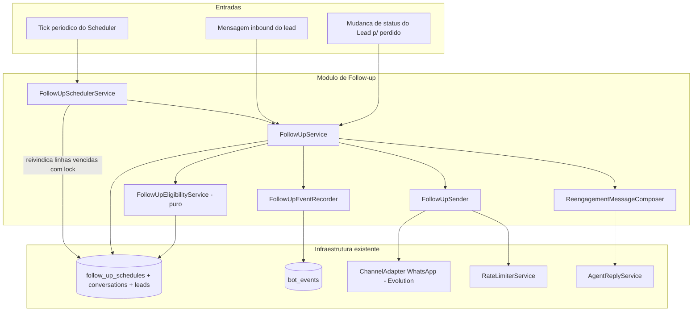
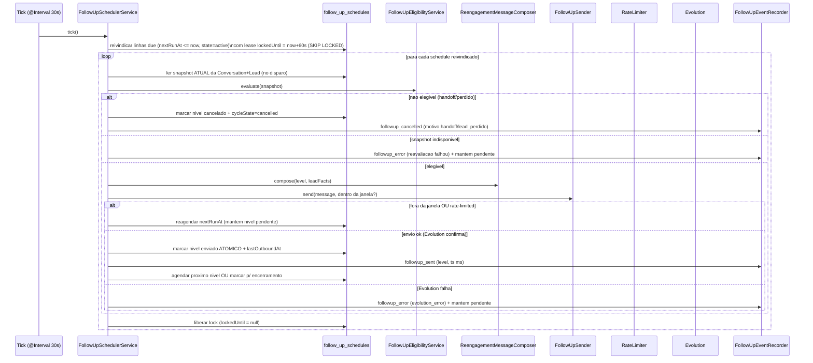
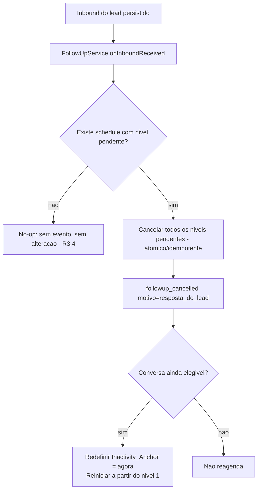
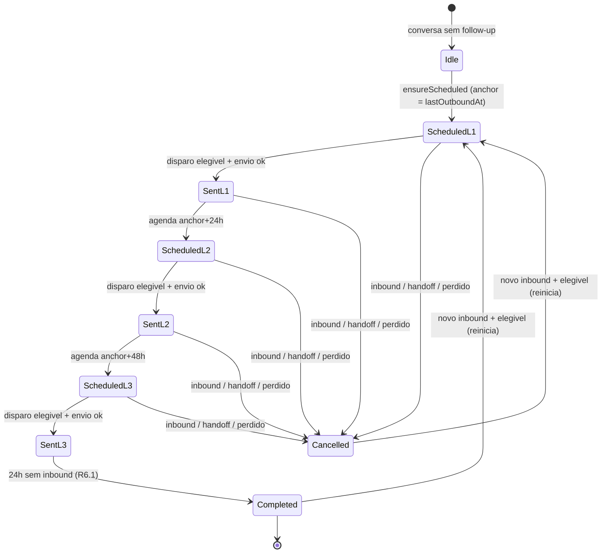
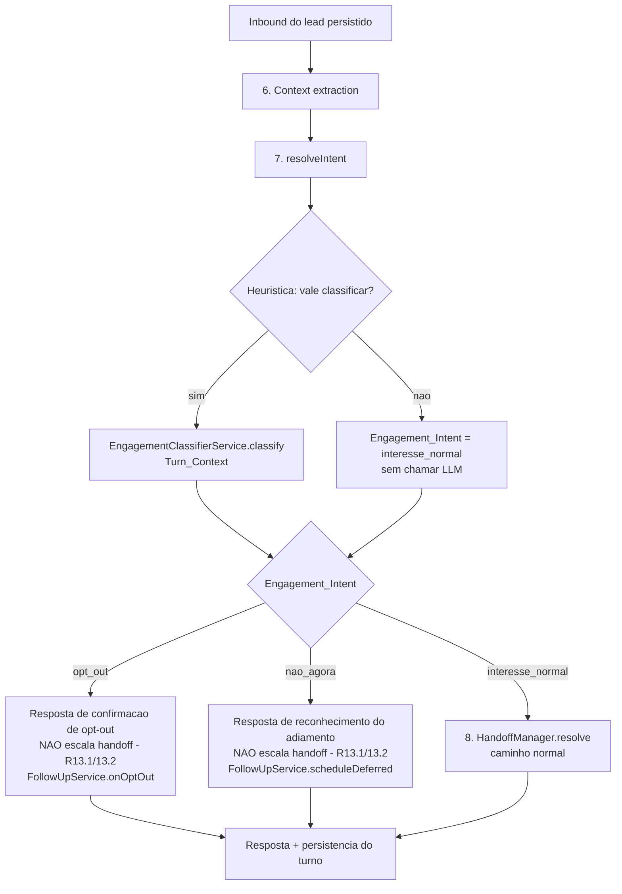

# Design Document

## Overview

Esta feature adiciona um mecanismo de **follow-up automático de leads** ao agente conversacional (NestJS + Prisma + Postgres, WhatsApp via Evolution). Quando um lead para de interagir, o sistema reengaja em três níveis temporais — **1 hora, 1 dia (24h) e 2 dias (48h)** após a inatividade — com mensagens contextualizadas que retomam o que já foi mapeado (segmento, dor principal) para requalificar o lead.

A feature é composta por dois componentes centrais descritos nos requisitos:

- **Scheduler** (`FollowUpSchedulerService`): avalia periodicamente as conversas com follow-up pendente e, quando um nível vence, aciona o Follow_Up_Service.
- **Follow_Up_Service** (`FollowUpService`): agenda, avalia elegibilidade, dispara, cancela e encerra ciclos de follow-up, registrando cada transição como evento em `bot_events`.

### Princípios de design

1. **Durabilidade e idempotência via banco**: o estado do ciclo de follow-up vive em uma nova tabela persistente (`follow_up_schedules`), não em memória. Isso garante que reinicializações do processo não percam agendamentos e que cada nível seja disparado **no máximo uma vez** (Requisito 7).
2. **Reavaliação no instante do disparo**: a regra crítica — nunca enviar follow-up a um lead já encaminhado ao humano — é verificada **lendo os dados atuais** da Conversation/Lead no momento exato do disparo, nunca com dados pré-carregados (Requisito 2.3).
3. **Reaproveitamento da infraestrutura existente**: o envio passa pelo `ChannelAdapter` do WhatsApp (Evolution) e respeita o `RateLimiterService` (token bucket) já existente; a auditoria usa a tabela `BotEvent`; a composição textual reaproveita o mecanismo de geração de resposta (`AgentReplyService`).
4. **Separação entre lógica pura e efeitos colaterais**: a decisão de elegibilidade, o cálculo do Inactivity_Anchor, a seleção do próximo nível e a montagem da mensagem são funções puras e testáveis; o disparo, a persistência e o envio ficam isolados na borda.

### Mapeamento de requisitos para componentes

| Requisito | Responsável principal |
|-----------|----------------------|
| R1 Agendamento dos três níveis | `FollowUpSchedulerService` + `FollowUpService.scheduleNext` |
| R2 Elegibilidade e cancelamento por handoff | `FollowUpEligibilityService` (puro) + `FollowUpService.evaluateAtDispatch` |
| R3 Cancelamento por resposta do lead | `FollowUpService.onInboundReceived` (hook no inbound) |
| R4 Cancelamento por desistência | `FollowUpEligibilityService` (status `perdido`) + `FollowUpService` |
| R5 Mensagens contextualizadas | `ReengagementMessageComposer` |
| R6 Encerramento após o último nível | `FollowUpService.completeIfExhausted` |
| R7 Idempotência dos disparos | tabela `follow_up_schedules` (lock + marcação atômica) |
| R8 Observabilidade | `FollowUpEventRecorder` (grava em `bot_events`) |
| R9 Envio respeitando limites | `FollowUpSender` (Evolution + Rate_Limiter + janela) |
| R10 Detecção contextual de desengajamento | `EngagementClassifierService` (LLM síncrono e leve no turno) |
| R11 Follow-up adiado | `FollowUpService.scheduleDeferred` + extensão de `follow_up_schedules` |
| R12 Opt-out definitivo | `FollowUpEligibilityService` (estado `opted_out`) + `FollowUpService.onOptOut` |
| R13 Roteamento sem escalonamento indevido | Integração no `ConversationService.handleInboundMessage` (precedência do Engagement_Intent) |

> **Nota sobre a evolução (R10–R13).** Os requisitos 1–9 permanecem com o design já descrito acima. Os requisitos 10–13 acrescentam uma **classificação contextual de engajamento por turno** e dois novos desfechos do ciclo (follow-up adiado e opt-out). As mudanças nos componentes 1–9 são **mínimas e aditivas**: a elegibilidade ganha o estado `opted_out`; o `FollowUpSchedule` ganha campos para o adiamento e o opt-out; o pipeline do turno passa a consultar o Engagement_Intent antes de decidir resposta e handoff. Toda a especificação nova está concentrada na seção [Engagement classification (Requisitos 10–13)](#engagement-classification-requisitos-1013).

## Architecture

### Visão de alto nível

O ciclo de vida de um follow-up percorre dois caminhos de entrada: o **tick periódico** do Scheduler (que dispara níveis vencidos) e o **evento de inbound** (que cancela/reinicia o ciclo). Ambos operam sobre a mesma fonte de verdade persistente: a tabela `follow_up_schedules`.



### Decisão de agendamento: tabela persistente + polling

Foram avaliadas duas abordagens para o agendamento periódico:

**Opção A — timers em memória (`setTimeout` por nível).** Simples, mas o estado se perde a cada reinício do processo, viola a durabilidade exigida por R1/R7 (níveis pendentes precisam sobreviver a deploys) e não suporta múltiplas instâncias.

**Opção B — tabela de follow-ups agendados + polling periódico (escolhida).** Cada conversa em follow-up tem uma linha em `follow_up_schedules` com o instante do próximo disparo (`nextRunAt`). Um job periódico (poll) seleciona as linhas vencidas, reivindica cada uma com um lock de banco e processa o disparo. Vantagens:

- **Durabilidade**: agendamentos sobrevivem a reinícios; o estado é o banco.
- **Idempotência e concorrência**: o lock por linha (`lockedUntil`, lease de 60s) e a marcação atômica do nível enviado atendem diretamente R7.1, R7.3 e R7.6.
- **Tolerância de 60s**: os requisitos exigem desvio máximo de 60 segundos em relação ao instante agendado (R1.2–R1.4). Com o poll rodando a cada **30 segundos**, o atraso máximo de detecção é ~30s, dentro da tolerância.
- **Escalabilidade futura**: `SELECT ... FOR UPDATE SKIP LOCKED` permite múltiplas instâncias sem disparo duplicado.

Para o tick periódico, a opção idiomática no NestJS é o pacote **`@nestjs/schedule`** (decorator `@Cron`/`@Interval`). Ele ainda não é dependência do projeto e deve ser adicionado. Caso se prefira evitar a dependência, um `setInterval` registrado em `onModuleInit` produz o mesmo efeito; o design não depende do mecanismo de tick em si, apenas de um gatilho a cada ~30s.

> Decisão: **`@nestjs/schedule` com `@Interval(30_000)`** disparando `FollowUpSchedulerService.tick()`. Justificativa: integra-se ao ciclo de vida do Nest, é testável (o tick é um método público invocável diretamente nos testes) e mantém a cadência de polling desacoplada da lógica de negócio.

### Pipeline de disparo (tick do Scheduler)



### Pipeline de inbound (cancelamento/reinício)

O hook de cancelamento é acionado de dentro do fluxo de inbound já existente. O ponto de integração é o `InboundMessageProcessor` (após persistir o inbound e fazer backfill da proveniência) e/ou o `ConversationService.handleInboundMessage`, onde a mensagem inbound do lead é registrada. O Follow_Up_Service expõe `onInboundReceived(conversationId)`:



O cancelamento por inbound é **idempotente** (R3.6): se já não há nível pendente, é no-op e nenhum `followup_cancelled` duplicado é gravado.

### Estrutura de módulo

Um novo módulo `FollowUpModule` (`apps/api/src/followup/`) reúne os serviços e é importado em `AppModule`. Ele importa `PrismaModule`, `ChannelModule` (para o `ChannelAdapterRegistry`/Evolution), `AgentModule` (para `AgentReplyService`) e usa o `RateLimiterService` (provido em escopo apropriado). O `InboundModule` passa a depender do `FollowUpService` para invocar o hook de inbound.

```
apps/api/src/followup/
  followup.module.ts
  followup.service.ts                 # FollowUpService (orquestracao + efeitos)
  followup-scheduler.service.ts       # FollowUpSchedulerService (@Interval tick)
  followup-eligibility.service.ts     # FollowUpEligibilityService (PURO)
  reengagement-message.composer.ts    # ReengagementMessageComposer (PURO + opcional LLM)
  followup-sender.service.ts          # FollowUpSender (Evolution + RateLimiter + janela)
  followup-event.recorder.ts          # FollowUpEventRecorder (bot_events com retry)
  followup.types.ts                   # tipos/enums (motivos, niveis, snapshot)
  followup.constants.ts               # niveis, offsets, janela, limites de retry
```

## Components and Interfaces

### FollowUpEligibilityService (lógica pura)

Centraliza toda a regra de elegibilidade (R2.1, R4.1). Recebe um **snapshot** imutável dos campos relevantes da Conversation e do Lead e devolve a decisão. Não faz I/O — por isso é facilmente testável por propriedades.

```typescript
/** Snapshot dos campos lidos da Conversation + Lead no instante avaliado. */
export interface ConversationSnapshot {
  leadStatus: string;              // novo | qualificando | chamar_humano | perdido
  stage: string;                   // abertura | descoberta | conversao | handoff_humano
  conversationStatus: string;      // active | inactive
  botPaused: boolean;
  assignedTo: string | null;
  handoffAccepted: boolean;
  handoffCompleted: boolean;
  handoffRequired: boolean;
  optedOut: boolean;               // estado Opt_Out persistido (R12.2)
}

export type IneligibilityReason =
  | 'handoff_humano'   // qualquer condicao do R2.1
  | 'lead_perdido'     // status do lead = perdido (R4.1)
  | 'opt_out';         // Conversation no estado Opt_Out (R12.2)

export interface EligibilityResult {
  eligible: boolean;
  reason: IneligibilityReason | null;
}

@Injectable()
export class FollowUpEligibilityService {
  /**
   * Avalia a elegibilidade de uma Conversation para follow-up (R2.1, R4.1, R12.2).
   * Funcao TOTAL e deterministica: o mesmo snapshot sempre produz o mesmo
   * resultado, sem I/O.
   */
  evaluate(snapshot: ConversationSnapshot): EligibilityResult;
}
```

Regra (não elegível se qualquer condição for verdadeira):
- `leadStatus === 'chamar_humano'` → `handoff_humano`
- `handoffAccepted` ou `handoffCompleted` verdadeiros → `handoff_humano`
- `stage === 'handoff_humano'` → `handoff_humano`
- `botPaused` verdadeiro → `handoff_humano`
- `assignedTo` não nulo e diferente de string vazia → `handoff_humano`
- `leadStatus === 'perdido'` → `lead_perdido`
- `optedOut` verdadeiro (estado Opt_Out persistido) → `opt_out` (R12.2)

Caso contrário, `{ eligible: true, reason: null }`.

> **Mudança mínima (R12).** O `ConversationSnapshot` ganha o campo booleano `optedOut` (derivado de `follow_up_schedules.cycle_state === 'opted_out'`). A precedência entre motivos mantém `handoff_humano` e `lead_perdido` antes de `opt_out` apenas para fins de rotulagem do `reason`; o resultado `eligible = false` é o mesmo. Quando a única causa de inelegibilidade é o opt-out, o `reason` é `opt_out`.

### ReengagementMessageComposer (composição contextualizada)

Gera a Reengagement_Message para um nível, retomando o contexto mapeado (R5). É majoritariamente **determinístico e puro** (template contextual) para garantir limites verificáveis; opcionalmente enriquece o texto via `AgentReplyService`, mas o resultado final passa sempre por uma normalização que garante as invariantes (≤ 1000 caracteres, exatamente uma CTA/pergunta).

```typescript
export interface ReengagementContext {
  level: 1 | 2 | 3;
  segment: string | null;     // Lead.segment
  mainPain: string | null;    // Lead.mainPain
  agentName: string;
}

export interface ReengagementMessage {
  content: string;            // <= 1000 chars, exatamente 1 pergunta/CTA
  referencedSegment: boolean; // true quando o segmento foi referenciado
  referencedPain: boolean;    // true quando a dor principal foi referenciada
}

@Injectable()
export class ReengagementMessageComposer {
  /**
   * Monta a mensagem de reengajamento (R5.1-R5.5):
   *  - se segment preenchido -> referencia o valor exato do segmento;
   *  - se mainPain preenchido -> referencia o valor exato da dor;
   *  - se nenhum -> reengajamento generico, sem referencias;
   *  - SEMPRE inclui exatamente uma pergunta/CTA;
   *  - SEMPRE limita o conteudo a 1000 caracteres.
   */
  compose(ctx: ReengagementContext): ReengagementMessage;
}
```

A falha ou timeout de 30s na geração (R5.6) é tratada pelo `FollowUpService`: o nível permanece **não enviado** e um `followup_error` é registrado. O caminho determinístico não tem timeout; o limite de 30s aplica-se apenas ao enriquecimento por LLM, que, se estourar, faz fallback ao texto determinístico (sempre disponível).

### FollowUpSender (envio via Evolution + Rate_Limiter + janela)

Encapsula o envio respeitando os limites e a janela (R9). Não decide elegibilidade nem idempotência — apenas tenta entregar e classifica o resultado.

```typescript
export type SendOutcome =
  | { status: 'sent'; sentAt: Date }          // Evolution confirmou
  | { status: 'deferred'; reason: 'out_of_window' | 'rate_limited' }
  | { status: 'failed'; reason: 'evolution_error' };

@Injectable()
export class FollowUpSender {
  /**
   * Envia a Reengagement_Message pelo WhatsApp (R9):
   *  - se fora da janela permitida -> deferred(out_of_window) (R9.2);
   *  - se RateLimiter rejeita -> deferred(rate_limited) (R9.3);
   *  - usa o ChannelAdapter do WhatsApp (Evolution) p/ enviar (R9.1);
   *  - on sucesso, devolve sentAt p/ atualizar lastOutboundAt (R9.6);
   *  - on falha do Evolution -> failed(evolution_error) (R9.4).
   */
  send(params: {
    phone: string;
    instanceName: string | null;
    conversationId: string;
    content: string;
    now: Date;
  }): Promise<SendOutcome>;

  /** True se `now` esta dentro da janela de envio configurada (R9.2). */
  isWithinSendWindow(now: Date): boolean;
}
```

A janela de envio é configurável (ver Data Models / Config). O Rate_Limiter usado é o `RateLimiterService` existente (token bucket), com chave por telefone, coerente com o uso no inbound.

### FollowUpService (orquestração)

Coordena o ciclo completo. Métodos principais:

```typescript
@Injectable()
export class FollowUpService {
  /** Cria/garante o schedule e agenda o Nivel 1 a partir do anchor (R1.1, R1.2). */
  ensureScheduled(conversationId: string): Promise<void>;

  /**
   * Processa um schedule vencido reivindicado pelo Scheduler:
   * reavalia elegibilidade no instante do disparo (R2.3), compoe e envia,
   * marca o nivel enviado de forma atomica (R7.1), agenda o proximo nivel
   * (R1.3, R1.4) ou marca p/ encerramento (R6). Idempotente sob lock (R7.3).
   */
  processDue(scheduleId: string, now: Date): Promise<void>;

  /**
   * Hook de inbound (R3): cancela niveis pendentes e, se a conversa segue
   * elegivel, redefine o Inactivity_Anchor para agora e reinicia no Nivel 1.
   * Idempotente e no-op quando nao ha nivel pendente (R3.4, R3.6).
   */
  onInboundReceived(conversationId: string, now: Date): Promise<void>;

  /** Reage a mudanca de status do Lead para `perdido` (R4.2). */
  onLeadLost(conversationId: string, now: Date): Promise<void>;

  /** Encerra o ciclo apos a janela de 24h do Nivel 3 sem resposta (R6.1). */
  completeIfExhausted(scheduleId: string, now: Date): Promise<void>;
}
```

### FollowUpEventRecorder (observabilidade)

Grava os Follow_Up_Event na tabela `bot_events`, com retry (R8.4) e degradação graciosa (R8.5).

```typescript
export type FollowUpEventType =
  | 'followup_sent'
  | 'followup_cancelled'
  | 'followup_completed'
  | 'followup_error';

export type CancelReason =
  | 'handoff_humano'
  | 'lead_perdido'
  | 'resposta_do_lead'
  | 'opt_out';            // cancelamento por opt-out (R12.5)

@Injectable()
export class FollowUpEventRecorder {
  /**
   * Registra um Follow_Up_Event em bot_events. Tenta ate 3 vezes adicionais
   * (R8.4); esgotadas as tentativas, loga o erro com conversationId+tipo e
   * NAO interrompe o processamento (R8.5).
   * O payload inclui o instante em ISO-8601 com precisao de milissegundos.
   */
  record(event: {
    type: FollowUpEventType;
    conversationId: string;
    leadId: string;
    level?: 1 | 2 | 3;
    reason?: CancelReason | 'evolution_error' | 'schedule_failed' | 'reevaluation_failed';
    occurredAt: Date;
  }): Promise<void>;
}
```

### FollowUpSchedulerService (tick)

```typescript
@Injectable()
export class FollowUpSchedulerService {
  /**
   * Disparado a cada ~30s (@Interval). Reivindica os schedules vencidos
   * (nextRunAt <= now, cycleState=active, lock livre) aplicando um lease de
   * 60s (lockedUntil), e delega cada um ao FollowUpService.processDue.
   * Tambem varre os schedules em janela de encerramento (Nivel 3 disparado
   * ha mais de 24h) para chamar completeIfExhausted (R6.1).
   */
  @Interval(30_000)
  async tick(now: Date = new Date()): Promise<void>;
}
```

### Pontos de integração no código existente

- **Inbound** (`InboundMessageProcessor.process` / `flushDebouncedTurn`): após persistir o inbound do lead, chamar `followUpService.onInboundReceived(conversationId, now)`. Como esse processamento já é assíncrono fora da resposta ao webhook, o cancelamento em ≤ 5s (R3.1) é folgado.
- **ConversationService**: ao detectar transição de `status` do lead para `perdido` (intent `desistance`), chamar `followUpService.onLeadLost(conversationId, now)` (R4.2).
- **Após resposta do bot**: quando o bot envia um outbound aguardando resposta e a conversa permanece elegível, `ensureScheduled` é chamado para (re)agendar o Nível 1 a partir do `lastOutboundAt` (R1.1).

## Data Models

### Nova tabela: `follow_up_schedules`

Uma linha por Conversation rastreia todo o ciclo de follow-up. A unicidade por `conversationId` garante que não existam ciclos concorrentes para a mesma conversa.

```prisma
model FollowUpSchedule {
  id             String   @id @default(uuid()) @db.Uuid
  conversationId String   @unique @map("conversation_id") @db.Uuid
  leadId         String   @map("lead_id") @db.Uuid

  // Estado do ciclo: 'active' (em andamento), 'cancelled' (cancelado por
  // handoff/perdido/resposta), 'completed' (esgotou os 3 niveis).
  cycleState     String   @default("active") @map("cycle_state") @db.VarChar(20)

  // Instante a partir do qual a inatividade e medida (Inactivity_Anchor).
  inactivityAnchor DateTime @map("inactivity_anchor")

  // Maior nivel ja enviado (0 = nenhum). A marcacao atomica de "enviado"
  // incrementa este campo condicionalmente (WHERE max_sent_level < :level),
  // garantindo idempotencia e monotonicidade (R7.1, R7.2).
  maxSentLevel   Int      @default(0) @map("max_sent_level") @db.SmallInt

  // Proximo nivel a disparar (1..3) e seu instante agendado. Null quando nao
  // ha nivel pendente (ciclo cancelado/encerrado).
  pendingLevel   Int?     @map("pending_level") @db.SmallInt
  nextRunAt      DateTime? @map("next_run_at")

  // Instante em que o Nivel 3 foi disparado, base p/ a janela de 24h de
  // encerramento (R6.1).
  level3FiredAt  DateTime? @map("level3_fired_at")

  // Controle de concorrencia (lease lock). Uma linha esta "reivindicada"
  // enquanto lockedUntil > now; o lease expira em 60s (R7.6).
  lockedUntil    DateTime? @map("locked_until")

  // Tentativas adiadas do disparo corrente (janela/rate-limit/erro), p/ o
  // limite maximo de reenvios (R9.5).
  deferredAttempts Int     @default(0) @map("deferred_attempts") @db.SmallInt

  lastError      String?  @map("last_error") @db.VarChar(2000)

  createdAt      DateTime @default(now()) @map("created_at")
  updatedAt      DateTime @updatedAt @map("updated_at")

  conversation   Conversation @relation(fields: [conversationId], references: [id])

  @@index([cycleState, nextRunAt])
  @@index([cycleState, level3FiredAt])
  @@map("follow_up_schedules")
}
```

Relação inversa em `Conversation`:

```prisma
model Conversation {
  // ... campos existentes ...
  followUpSchedule FollowUpSchedule?
}
```

### Migração Prisma correspondente

Arquivo `apps/api/prisma/migrations/<timestamp>_add_follow_up_schedules/migration.sql` (aditivo, sem alterar tabelas existentes além da relação implícita por FK):

```sql
-- CreateTable
CREATE TABLE "follow_up_schedules" (
    "id" UUID NOT NULL DEFAULT gen_random_uuid(),
    "conversation_id" UUID NOT NULL,
    "lead_id" UUID NOT NULL,
    "cycle_state" VARCHAR(20) NOT NULL DEFAULT 'active',
    "inactivity_anchor" TIMESTAMP(3) NOT NULL,
    "max_sent_level" SMALLINT NOT NULL DEFAULT 0,
    "pending_level" SMALLINT,
    "next_run_at" TIMESTAMP(3),
    "level3_fired_at" TIMESTAMP(3),
    "locked_until" TIMESTAMP(3),
    "deferred_attempts" SMALLINT NOT NULL DEFAULT 0,
    "last_error" VARCHAR(2000),
    "created_at" TIMESTAMP(3) NOT NULL DEFAULT CURRENT_TIMESTAMP,
    "updated_at" TIMESTAMP(3) NOT NULL,

    CONSTRAINT "follow_up_schedules_pkey" PRIMARY KEY ("id")
);

-- CreateIndex (uma linha por conversa: sem ciclos concorrentes)
CREATE UNIQUE INDEX "follow_up_schedules_conversation_id_key" ON "follow_up_schedules"("conversation_id");

-- CreateIndex (selecao eficiente dos vencidos pelo poll)
CREATE INDEX "follow_up_schedules_cycle_state_next_run_at_idx" ON "follow_up_schedules"("cycle_state", "next_run_at");

-- CreateIndex (varredura da janela de encerramento do Nivel 3)
CREATE INDEX "follow_up_schedules_cycle_state_level3_fired_at_idx" ON "follow_up_schedules"("cycle_state", "level3_fired_at");

-- AddForeignKey
ALTER TABLE "follow_up_schedules" ADD CONSTRAINT "follow_up_schedules_conversation_id_fkey" FOREIGN KEY ("conversation_id") REFERENCES "conversations"("id") ON DELETE CASCADE ON UPDATE CASCADE;
```

### Auditoria: novos tipos em `bot_events`

A tabela `BotEvent` existente (`conversation_id`, `lead_id`, `type`, `payload`, `created_at`) é reaproveitada. Adicionam-se os novos `type`:

| `type` | Quando | `payload` |
|--------|--------|-----------|
| `followup_sent` | Reengagement_Message enviada com sucesso (R8.1) | `{ level, occurredAt }` (occurredAt ISO-8601 com ms) |
| `followup_cancelled` | Ciclo cancelado (R8.2) | `{ reason, occurredAt }` reason ∈ {`handoff_humano`, `lead_perdido`, `resposta_do_lead`, `opt_out`} |
| `followup_completed` | Ciclo encerrado por esgotamento (R8.3) | `{ occurredAt }` |
| `followup_error` | Falha (envio/cancelamento/registro/reavaliação) | `{ reason, level?, detail? }` |

### Configuração (env / `config.schema.ts`)

Novos parâmetros validados via Joi, com defaults seguros:

```typescript
// Offsets dos niveis (horas) — fixos por requisito, expostos p/ teste.
FOLLOWUP_LEVEL1_HOURS: default 1
FOLLOWUP_LEVEL2_HOURS: default 24
FOLLOWUP_LEVEL3_HOURS: default 48
// Janela de resposta apos o Nivel 3 antes de encerrar (horas).
FOLLOWUP_COMPLETION_WINDOW_HOURS: default 24
// Janela diaria de envio permitida (formato HH:mm-HH:mm, fuso America/Sao_Paulo).
FOLLOWUP_SEND_WINDOW: default '08:00-20:00'
// Espera minima ao reagendar por rate-limit (segundos, minimo 60).
FOLLOWUP_RETRY_BACKOFF_SECONDS: default 60
// Maximo de tentativas adiadas por nivel antes de interromper (R9.5).
FOLLOWUP_MAX_DEFERRALS: default 10
// Cadencia do poll (ms) — <= 60000 p/ respeitar a tolerancia de 60s.
FOLLOWUP_POLL_INTERVAL_MS: default 30000
```

### Modelo de estados do ciclo



## Engagement classification (Requisitos 10–13)

Esta seção especifica a evolução que adiciona **detecção contextual de engajamento por turno** e dois novos desfechos do ciclo de follow-up: o **follow-up adiado** (R11) e o **opt-out definitivo** (R12), além do **roteamento sem escalonamento indevido** (R13). O problema concreto que motiva a mudança: hoje uma desistência educada como *"não, eu volto a te acionar quando eu quiser"* cai no caminho que escala para humano (a palavra "quando" casa com `QUESTION_WORDS`/intenção e/ou a auto-escala do `general` em estado `suggested`), tratando um adiamento como pedido de atendimento humano. A correção é classificar a **intenção de engajamento** do turno com contexto e dar a essa classificação **precedência** sobre o roteamento de handoff, no MESMO turno.

### Por que um classificador novo e separado do AgentAnalysisService

O `AgentAnalysisService` existente é **assíncrono, pesado e throttled** (prompt de ~1200 tokens, 15–25s, debounce de uma análise por conversa e amostragem a cada 3 turnos — ver `ConversationService` passo 15). Ele roda **depois** do turno e por isso **não pode** ser a fonte do Engagement_Intent: R13.3/R13.4 exigem que a classificação esteja disponível **antes** da geração da resposta, valendo no turno corrente. Reaproveitá-lo no caminho do turno reintroduziria exatamente a contenção de latência que ele foi desenhado para evitar.

> **Decisão:** criar um `EngagementClassifierService` **síncrono e leve**, dedicado ao turno, com uma **chamada LLM curta** (prompt mínimo, poucas dezenas de tokens) via a `LLMProvider` já existente (`complete({ responseFormat: 'json' })`). Ele é independente do `AgentAnalysisService`; ambos coexistem (o de CRM continua refinando o lead em segundo plano). O glossário chama o conceito de `Engagement_Classifier`; a implementação é o `EngagementClassifierService`.

### EngagementClassifierService (classificador síncrono do turno)

Componente puro na fronteira (uma única dependência de borda: a `LLMProvider`). Recebe o `Turn_Context` — a última pergunta/outbound do bot e a resposta inbound do Lead — e retorna o Engagement_Intent do turno.

```typescript
export type EngagementIntent = 'interesse_normal' | 'nao_agora' | 'opt_out';

/** Par (pergunta do bot, resposta do lead) que forma o Turn_Context (R10.2). */
export interface TurnContext {
  lastBotMessage: string | null;   // ultima pergunta/outbound do bot
  leadMessage: string;             // inbound do lead que respondeu
}

export interface EngagementClassification {
  intent: EngagementIntent;
  confidence: number;              // 0..1
  /** Presente apenas quando intent === 'nao_agora' e o lead indica prazo. */
  deferral?: { durationHours?: number };
  /** true quando o resultado veio do fail-safe (timeout/erro/baixa confianca). */
  failSafe: boolean;
}

@Injectable()
export class EngagementClassifierService {
  /**
   * Classifica o Engagement_Intent de um turno a partir do Turn_Context (R10).
   * - Uma unica chamada LLM curta, responseFormat 'json', temperatura baixa.
   * - SEM listas de palavras-chave fixas (R10.3).
   * - confidence < 0.70 OU empate/ambiguidade -> 'interesse_normal' (R10.6).
   * - fato de negocio (mesmo com negacoes) -> 'interesse_normal' (R10.5, R10.7).
   * - timeout de 10s OU erro -> 'interesse_normal' + log + failSafe=true (R10.9).
   */
  classify(ctx: TurnContext): Promise<EngagementClassification>;
}
```

**Forma do JSON retornado pelo LLM** (validado e normalizado pelo serviço):

```json
{ "engagementIntent": "interesse_normal" | "nao_agora" | "opt_out",
  "confidence": 0.0,
  "deferral": { "durationHours": 12 } }
```

**Prompt mínimo (esboço).** Um `system` curto descreve a tarefa e as três classes; o `user` injeta apenas o `Turn_Context`:

```
system: Você classifica a intenção de engajamento do lead em UM turno.
Responda só JSON {engagementIntent, confidence, deferral?}.
Classes:
- nao_agora: o lead pede explicitamente para ser contatado MAIS TARDE.
- opt_out: o lead pede explicitamente para PARAR de receber mensagens.
- interesse_normal: qualquer outra coisa, INCLUSIVE quando ele descreve um
  fato do negócio dele em resposta à pergunta (mesmo com negações, ex.: "os
  clientes não me chamam, eu que chamo eles").
Se houver dúvida/empate, use interesse_normal e confidence baixa.
Se o lead indicar prazo ("amanhã de manhã", "semana que vem"), estime
deferral.durationHours.
user: PERGUNTA DO BOT: {lastBotMessage}
RESPOSTA DO LEAD: {leadMessage}
```

**Regras de normalização (fato de negócio, R10.5/R10.7).** Mesmo que o LLM tente classificar como desengajamento, o serviço aplica a regra do fail-safe de confiança (`< 0.70 → interesse_normal`). A proteção contra **falso positivo** é tratada como **fato de negócio**: o prompt instrui explicitamente que negações que descrevem o funcionamento do negócio ("os clientes não me chamam, eu que chamo eles") são `interesse_normal`. Como reforço determinístico e barato (sem virar "lista de keywords de classificação", apenas um *guard* de segurança), classificações `opt_out`/`nao_agora` com `confidence` abaixo do limiar são rebaixadas a `interesse_normal`.

**Timeout e custo (R10.9, R13.5).** A chamada é disparada com um `Promise.race` contra um timeout de **10s**; ao estourar (ou em qualquer erro/parse inválido), o resultado é `interesse_normal` com `failSafe = true` e um log de aviso. O modelo é o provider configurado; recomenda-se o modelo mais barato/rápido disponível para esta chamada curta (config dedicada, ver Configuração). Por ser um prompt minúsculo, a latência típica é muito menor que a da análise de CRM.

### Heurística de quando classificar (custo/latência)

Classificar **todo** turno é desnecessário e caro. A classificação só agrega valor quando há risco de adiamento/opt-out mal interpretado ou quando o lead está em uma fase de decisão. A heurística (barata, determinística, avaliada antes da chamada LLM):

Classifica o turno **quando qualquer uma** for verdadeira:
- existe um follow-up pendente/ativo para a conversa (`follow_up_schedules.cycle_state ∈ {active, opted_out}`), pois é o cenário em que adiar/opt-out muda o agendamento;
- o turno anterior do bot foi uma **oferta de handoff** ou pedido de lista (estado `suggested`), onde a confusão "quando/adiamento × aceite" acontece;
- a conversa já está **qualificada** (heurística `qualificationReadyForOffer` já calculada no pipeline);
- a mensagem do lead contém uma **negação** combinada a uma referência temporal/recusa (heurística de *gating* leve — NÃO é critério de classificação, apenas decide se vale a pena chamar o LLM; a decisão final de classe é sempre do LLM, preservando R10.3).

Caso contrário, assume-se `interesse_normal` **sem** chamar o LLM. Importante: esse atalho **nunca** produz um Disengagement_Signal e, portanto, é seguro em relação a R13.5 (o default já é a classe segura, que não escala). Assim, R13.5 (fail-safe) e R10.9 (fail-safe por timeout/erro) convergem no mesmo desfecho: na dúvida, `interesse_normal`.

### Integração no pipeline do turno (handleInboundMessage) — R13

A classificação entra no `ConversationService.handleInboundMessage` **entre** a resolução de intenção (passo 7) e a decisão de handoff (passo 8), de modo a ter **precedência** sobre o caminho que hoje escala. O Engagement_Intent do turno é resolvido **antes** da geração da resposta (R13.3) e aplicado à decisão de resposta/roteamento do próprio turno (R13.4), sem depender da análise assíncrona (passo 15).



**Mudança mínima e precedência (R13.1, R13.2, R10.8).** Quando o Engagement_Intent é `nao_agora` ou `opt_out`:

- o turno **não** chama `HandoffManager.resolve` para escalar — em vez disso, o `nextHandoffState` é mantido em `none`/inalterado, e a resposta é determinística (reconhecimento do adiamento ou confirmação do opt-out). Isso impede tanto a interpretação como *pedido* de humano (R13.1) quanto como *aceite* de encaminhamento (R13.2), inclusive a regra 4b do `HandoffManager` (o `general` em `suggested` que hoje auto-escala);
- como o `Disengagement_Signal` por si só nunca escala (R10.8), o caminho de `frustration → preference_human` e a auto-escala do `suggested` ficam **subordinados** ao Engagement_Intent: se o turno é desengajamento, o roteamento de handoff é curto-circuitado antes do passo 8.

Concretamente, no `handleInboundMessage` isto é um *early branch* logo após resolver o Engagement_Intent: se for `nao_agora`/`opt_out`, define `finalReply` determinística, **não** marca `finalHandoff`, e delega o efeito de agendamento ao `FollowUpService` (`scheduleDeferred`/`onOptOut`). O `HandoffManagerService` permanece **inalterado** (continua puro); a precedência é resolvida no orquestrador, que é o ponto mínimo de mudança.

### Follow-up adiado (R11)

Quando o Engagement_Intent é `nao_agora`, o **Nível 1 (1h) é substituído** por um `Deferred_Followup` disparado após o `Deferral_Offset`. A cadência normal é retomada **a partir do disparo** do adiado: o próximo nível em **+24h** e o subsequente em **+48h** (R11.5).

**Deferral_Offset (R11.2–R11.4):**
- sem prazo indicado pelo lead → `Default_Deferral_Offset` (config `FOLLOWUP_DEFAULT_DEFERRAL_HOURS`, default **5h**);
- com prazo indicado → `Inferred_Deferral` do LLM (`deferral.durationHours`), com **piso de 1h** e **sem teto** (R11.3);
- prazo indicado mas inferência inválida/ausente/`< 1h`/timeout de 30s → `Default_Deferral_Offset` de 5h, mantendo a conversa elegível para o adiado (R11.4).

Novo método no `FollowUpService`:

```typescript
@Injectable()
export class FollowUpService {
  /**
   * Agenda um Deferred_Followup em substituicao ao Nivel 1 (R11.1-R11.5).
   * - offsetHours: Deferral_Offset ja resolvido (default 5h, ou Inferred_Deferral
   *   com piso de 1h e sem teto). A cadencia normal (+24h, +48h) e retomada a
   *   partir do disparo do adiado.
   * - Envia, em ate 30s, a mensagem de reconhecimento do adiamento (R11.6),
   *   mantendo a conversa SEM encaminhamento ao time humano.
   */
  scheduleDeferred(conversationId: string, offsetHours: number, now: Date): Promise<void>;
}
```

**Modelo do adiamento sobre `follow_up_schedules`.** Reaproveita-se o mecanismo de `pendingLevel`/`nextRunAt` com um **flag** e um **offset** explícitos, em vez de criar um novo nível artificial:

- novo campo `deferred: Boolean @default(false)` — indica que o disparo pendente é um Deferred_Followup (substitui o Nível 1);
- novo campo `deferralOffsetHours: Int?` — o Deferral_Offset aplicado (para auditoria e para o cálculo de retomada);
- ao agendar: `inactivityAnchor = now`, `maxSentLevel = 0`, `pendingLevel = 1`, `deferred = true`, `deferralOffsetHours = offsetHours`, `nextRunAt = now + offsetHours`;
- no disparo bem-sucedido do adiado, o `handleSent` trata o nível como "Nível 1 cumprido": agenda o próximo a partir do **instante do disparo** (`sentAt`) usando os offsets normais relativos (Nível 2 = `sentAt + 24h`, Nível 3 = `sentAt + 48h`). Isto é a única adaptação de `handleSent`: quando `deferred === true` e `level === 1`, o anchor de retomada passa a ser `sentAt` em vez do `inactivityAnchor` original; em seguida `deferred` volta a `false`.

**Reinício/cancelamento por inbound (R11.7, R11.8).** Um inbound antes do disparo do adiado cai no `onInboundReceived` já existente: cancela o pendente (incluindo o adiado) e remove a elegibilidade para o Deferred_Followup. Enquanto o Engagement_Intent corrente for `nao_agora`, a conversa permanece classificada como elegível para o adiado (R11.8) — representado por `deferred = true` no schedule ativo.

**Mensagem de reconhecimento (R11.6).** Resposta determinística do turno (não passa pelo Scheduler), enviada na geração da resposta do próprio turno, confirmando o adiamento e informando que o contato será retomado no prazo do `Deferral_Offset`, sem handoff.

### Opt-out definitivo (R12)

Quando o Engagement_Intent é `opt_out`, o ciclo é cancelado e a conversa entra no estado **Opt_Out**, persistido como um novo valor de `cycle_state`:

- novo valor de `cycleState`: **`opted_out`** (além de `active`/`cancelled`/`completed`). Escolheu-se reusar a coluna existente em vez de um flag em `lead.status`, porque o opt-out é uma decisão sobre o **follow-up** (não sobre a qualificação comercial do lead) e precisa sobreviver e ser consultada na elegibilidade do ciclo;
- o `ConversationSnapshot.optedOut` é derivado de `cycleState === 'opted_out'`; a elegibilidade retorna `{ eligible: false, reason: 'opt_out' }` (R12.2);
- novo motivo de cancelamento `opt_out` em `CancelReason` e o `followup_cancelled` correspondente (R12.5).

Novo método no `FollowUpService`:

```typescript
@Injectable()
export class FollowUpService {
  /**
   * Processa o opt-out de um turno (R12): cancela os niveis pendentes em ate 5s,
   * NAO reinicia o ciclo, persiste cycleState='opted_out' e registra exatamente
   * um followup_cancelled com motivo 'opt_out'. Idempotente sob turnos repetidos
   * de opt_out (R12.6). Em falha de persistencia, preserva pendentes, suprime
   * envios e registra followup_error (R12.7).
   */
  onOptOut(conversationId: string, now: Date): Promise<void>;

  /**
   * Reentrada apos opt-out (R12.4): quando um turno posterior e classificado como
   * 'interesse_normal', remove o estado Opt_Out, redefine o Inactivity_Anchor
   * para now e reinicia o ciclo normal a partir do Nivel 1 (delegando ao mesmo
   * caminho de reinicio do onInboundReceived — R3).
   */
  resumeFromOptOut(conversationId: string, now: Date): Promise<void>;
}
```

**Idempotência (R12.6).** Como em `onInboundReceived`, o cancelamento usa `updateMany` com guarda por estado (`cycleState IN (active)` e `pendingLevel != null`), e a transição para `opted_out` é condicional. Turnos repetidos de `opt_out` não cancelam novamente nem duplicam o evento (segunda execução: `count === 0` → no-op).

**Reentrada (R12.4).** Um turno posterior classificado como `interesse_normal` chama `resumeFromOptOut`: zera `opted_out`, redefine o anchor para `now` e reinicia no Nível 1, exatamente como o reinício por inbound do R3. Distinção importante: a reentrada exige `interesse_normal` **genuíno** — um novo `nao_agora` não reativa o ciclo normal (apenas reprograma o adiado), e um `opt_out` é no-op idempotente.

**Não escala (R12.3, R13).** O turno de `opt_out` nunca é tratado como pedido nem aceite de humano; a resposta é uma confirmação determinística da baixa, sem handoff.

### Extensões de dados (Requisitos 11, 12)

Alterações **aditivas** em `follow_up_schedules` (nenhuma coluna existente muda de tipo ou é removida):

```prisma
model FollowUpSchedule {
  // ... campos existentes ...

  // Estado do ciclo: agora inclui 'opted_out' (R12.2), alem de
  // 'active' | 'cancelled' | 'completed'.
  cycleState String @default("active") @map("cycle_state") @db.VarChar(20)

  // R11: disparo pendente e um Deferred_Followup (substitui o Nivel 1).
  deferred           Boolean @default(false) @map("deferred")
  // R11: Deferral_Offset aplicado, em horas (default 5h ou Inferred_Deferral).
  deferralOffsetHours Int?   @map("deferral_offset_hours") @db.SmallInt
}
```

Migração Prisma correspondente (aditiva), `apps/api/prisma/migrations/<timestamp>_add_followup_deferral_optout/migration.sql`:

```sql
-- AlterTable: campos aditivos do follow-up adiado (R11). 'opted_out' e apenas
-- um novo valor textual de cycle_state (VARCHAR), sem alteracao de schema.
ALTER TABLE "follow_up_schedules"
  ADD COLUMN "deferred" BOOLEAN NOT NULL DEFAULT false,
  ADD COLUMN "deferral_offset_hours" SMALLINT;
```

### Configuração adicional (env / `config.schema.ts`)

Novos parâmetros validados via Joi, com defaults seguros:

```typescript
// Deferral_Offset padrao do follow-up adiado, em horas (R11.2).
FOLLOWUP_DEFAULT_DEFERRAL_HOURS: default 5
// Piso do Inferred_Deferral, em horas (R11.3). Sem teto.
FOLLOWUP_MIN_DEFERRAL_HOURS: default 1
// Timeout (ms) da classificacao de engajamento no turno (R10.9).
ENGAGEMENT_CLASSIFIER_TIMEOUT_MS: default 10000
// Timeout (ms) da inferencia do prazo de adiamento (R11.4).
ENGAGEMENT_DEFERRAL_INFER_TIMEOUT_MS: default 30000
// Limiar minimo de confianca; abaixo dele -> interesse_normal (R10.6).
ENGAGEMENT_CONFIDENCE_THRESHOLD: default 0.70
// Modelo/efetividade da chamada curta de classificacao (opcional; barato/rapido).
ENGAGEMENT_CLASSIFIER_MODEL: default '' (usa o provider padrao)
```

### Mapeamento das decisões → requisitos (R10–R13)

| Decisão de design | Requisitos |
|-------------------|-----------|
| `EngagementClassifierService` síncrono e leve, separado do CRM | R10.1, R10.2, R13.3, R13.4 |
| Sem keywords; classe decidida pelo LLM | R10.3, R10.4 |
| Fato de negócio (mesmo com negações) → `interesse_normal` | R10.5, R10.7 |
| `confidence < 0.70`/empate → `interesse_normal` | R10.6 |
| Timeout 10s/erro → `interesse_normal` + log | R10.9, R13.5 |
| Precedência do Engagement_Intent sobre handoff no turno | R10.8, R13.1, R13.2 |
| `scheduleDeferred` substitui Nível 1 e retoma +24h/+48h | R11.1, R11.5 |
| Default 5h / Inferred_Deferral piso 1h sem teto / fallback 5h | R11.2, R11.3, R11.4 |
| Mensagem de reconhecimento do adiamento, sem handoff | R11.6 |
| Inbound cancela adiado; `nao_agora` mantém elegível ao adiado | R11.7, R11.8 |
| `cycleState='opted_out'` + elegibilidade `opt_out` | R12.1, R12.2 |
| Opt-out não escala; evento `followup_cancelled`/`opt_out` | R12.3, R12.5 |
| Reentrada com `interesse_normal` reinicia no Nível 1 | R12.4 |
| Idempotência do opt-out; degradação em falha | R12.6, R12.7 |

## Correctness Properties

*Uma propriedade é uma característica ou comportamento que deve ser verdadeiro em todas as execuções válidas do sistema — essencialmente, uma afirmação formal sobre o que o software deve fazer. Propriedades são a ponte entre especificações legíveis por humanos e garantias de correção verificáveis por máquina.*

As propriedades abaixo derivam diretamente do prework. Elas serão implementadas com testes baseados em propriedade (property-based testing) usando `fast-check` (já presente no projeto), com no mínimo 100 iterações cada. A lógica testada é majoritariamente pura (elegibilidade, cálculo de anchor/offsets, seleção de nível, composição); os efeitos de borda (Prisma, Evolution) são injetados via mocks/fakes em memória para manter as propriedades rápidas e determinísticas.

### Property 1: Elegibilidade é total e correta

*Para qualquer* `ConversationSnapshot`, `evaluate` retorna `eligible = false` se e somente se pelo menos uma condição de não-elegibilidade for verdadeira (`leadStatus === 'chamar_humano'`, `handoffAccepted`, `handoffCompleted`, `stage === 'handoff_humano'`, `botPaused`, `assignedTo` não nulo e não vazio, `leadStatus === 'perdido'`, ou `optedOut` — ver Property 21); o `reason` é `lead_perdido` quando a única causa é o status perdido e `handoff_humano` caso contrário (a rotulagem de `opt_out` é detalhada na Property 21); e a função é determinística.

**Validates: Requirements 2.1, 4.1**

### Property 2: Nunca dispara para conversa não elegível, reavaliando no instante do disparo

*Para qualquer* schedule com nível pendente cujo snapshot **lido no instante do disparo** seja não elegível, `processDue` não chama o `FollowUpSender`, marca o nível como cancelado, não agenda nenhum nível futuro e o estado do ciclo passa a `cancelled` — mesmo que o estado no momento do agendamento fosse elegível.

**Validates: Requirements 1.5, 1.7, 2.2, 2.3, 2.4, 4.2, 4.3**

### Property 3: Inactivity_Anchor é a última interação relevante

*Para qualquer* par de timestamps `lastOutboundAt` e `lastInboundAt` em que não exista inbound posterior ao último outbound, o Inactivity_Anchor calculado é exatamente igual a `lastOutboundAt`.

**Validates: Requirements 1.1**

### Property 4: Cada nível é agendado no offset correto a partir do anchor

*Para qualquer* Inactivity_Anchor e qualquer nível `n ∈ {1,2,3}`, o `nextRunAt` agendado para o nível `n` é exatamente `anchor + offset(n)`, onde `offset(1)=1h`, `offset(2)=24h`, `offset(3)=48h`.

**Validates: Requirements 1.2, 1.3, 1.4**

### Property 5: Monotonicidade e idempotência dos níveis (1 → 2 → 3, nunca repetir)

*Para qualquer* sequência de disparos bem-sucedidos sobre um ciclo, o próximo nível selecionado é sempre `maxSentLevel + 1` (em ordem crescente), `maxSentLevel` nunca decresce, nenhum nível é enviado mais de uma vez, e reprocessar um nível já marcado como enviado não produz nova mensagem.

**Validates: Requirements 1.3, 1.4, 7.1, 7.2, 7.4**

### Property 6: Inbound cancela todos os pendentes de forma idempotente com exatamente um evento

*Para qualquer* schedule com pelo menos um nível pendente, aplicar `onInboundReceived` deixa o ciclo sem nível pendente (cancelado) e registra **exatamente um** `followup_cancelled` com motivo `resposta_do_lead`; aplicar `onInboundReceived` novamente em seguida é um no-op (mesmo estado final, sem novo evento).

**Validates: Requirements 1.6, 3.1, 3.3, 3.6**

### Property 7: Inbound de conversa elegível reinicia o ciclo no Nível 1

*Para qualquer* schedule cuja Conversation permaneça elegível, ao receber um inbound no instante `t`, o Inactivity_Anchor é redefinido para `t` e o ciclo é reiniciado com `pendingLevel = 1` agendado para `t + 1h`.

**Validates: Requirements 3.2**

### Property 8: Inbound sem nível pendente é no-op

*Para qualquer* Conversation sem nenhum nível pendente (schedule inexistente, cancelado ou encerrado), `onInboundReceived` não grava `followup_cancelled` e não altera agendamentos existentes.

**Validates: Requirements 3.4**

### Property 9: Mensagem referencia segmento e dor quando preenchidos

*Para qualquer* `ReengagementContext`, a `Reengagement_Message` gerada contém o valor exato do segmento quando `segment` está preenchido e o valor exato da dor principal quando `mainPain` está preenchido; quando ambos estão vazios, a mensagem é genérica e não contém referências a segmento ou dor.

**Validates: Requirements 5.1, 5.2, 5.4**

### Property 10: Invariantes de forma da mensagem (≤ 1000 caracteres e exatamente uma CTA)

*Para qualquer* `ReengagementContext` (incluindo segmento e dor arbitrariamente longos e o caso genérico), a `Reengagement_Message` gerada tem no máximo 1000 caracteres e contém exatamente uma pergunta ou chamada para ação.

**Validates: Requirements 5.3, 5.4, 5.5**

### Property 11: Encerramento após o Nível 3 e estado terminal

*Para qualquer* ciclo cujo Nível 3 foi disparado há mais de 24 horas sem inbound, `completeIfExhausted` marca o ciclo como `completed` sem agendar novos níveis, e enquanto `completed` nenhum disparo ocorre; se um inbound chega dentro da janela de 24h após o Nível 3, o ciclo não é encerrado por `ciclo_concluido` e é tratado como cancelamento/reinício (Propriedades 6 e 7).

**Validates: Requirements 6.1, 6.3, 6.4**

### Property 12: Conteúdo e forma dos Follow_Up_Event

*Para qualquer* transição que gere um Follow_Up_Event, o evento registrado contém `conversationId` e `leadId`; um `followup_sent` inclui `level ∈ [1, máximo configurado]`; um `followup_cancelled` inclui um `reason` pertencente ao conjunto `{handoff_humano, lead_perdido, resposta_do_lead}`; e todo evento inclui o instante de ocorrência em formato data-hora com precisão de milissegundos.

**Validates: Requirements 4.4, 6.2, 8.1, 8.2, 8.3**

### Property 13: Lock de concorrência exclusivo com expiração de 60s

*Para qualquer* schedule, duas tentativas concorrentes de reivindicação resultam em no máximo uma aquisição do lock (a outra recebe indicação de bloqueio ativo); e um lock cujo lease expirou (mais de 60s sem confirmação) pode ser reivindicado novamente, com o nível ainda tratado como não enviado.

**Validates: Requirements 7.3, 7.6**

### Property 14: Disparo fora da janela é adiado sem marcar enviado

*Para qualquer* instante fora da janela de envio configurada, `send` retorna `deferred(out_of_window)`, o nível não é marcado como enviado e o `nextRunAt` é adiado para o início da próxima janela permitida.

**Validates: Requirements 9.2**

### Property 15: Rejeição do Rate_Limiter adia com backoff mínimo de 60s

*Para qualquer* disparo em que o `RateLimiterService` rejeite o envio, a `Reengagement_Message` permanece pendente (nível não marcado como enviado) e uma nova tentativa é reagendada após pelo menos 60 segundos.

**Validates: Requirements 9.3**

### Property 16: Envio confirmado atualiza lastOutboundAt

*Para qualquer* envio confirmado pelo Evolution_Channel no instante `sentAt`, o `lastOutboundAt` da Conversation é atualizado para `sentAt`.

**Validates: Requirements 9.6**

### Property 17: Falha de envio preserva o nível como pendente

*Para qualquer* disparo cujo envio falhe (Evolution retorna falha), o nível não é registrado como enviado, permanece pendente para nova tentativa e um Follow_Up_Event de erro é registrado.

**Validates: Requirements 7.5, 9.4**

### Property 18: Classificação de engajamento é total e segura sob baixa confiança

*Para qualquer* retorno do LLM (incluindo JSON inválido, classes desconhecidas e qualquer `confidence ∈ [0,1]`), `EngagementClassifierService.classify` produz um `Engagement_Intent` pertencente a exatamente `{interesse_normal, nao_agora, opt_out}`; e *para qualquer* classificação sugerida como `nao_agora` ou `opt_out` cujo `confidence` seja inferior ao limiar (0,70) ou haja empate/ambiguidade, o resultado é rebaixado para `interesse_normal` (incluindo o caso de fato de negócio com negações, como "os clientes não me chamam, eu que chamo eles").

**Validates: Requirements 10.1, 10.4, 10.5, 10.6, 10.7**

### Property 19: Fail-safe da classificação por timeout/erro/indeterminação

*Para qualquer* execução em que a análise contextual do LLM falhe, exceda 10 segundos, ou o Engagement_Intent não possa ser determinado, `classify` retorna `interesse_normal` com `failSafe = true` e registra a indicação de falha; nenhum Disengagement_Signal é produzido nesse caso.

**Validates: Requirements 10.9, 13.5**

### Property 20: Desengajamento nunca escala para o time humano

*Para qualquer* estado de handoff corrente (`none`, `suggested`, `accepted`) e *para qualquer* turno cujo Engagement_Intent seja `nao_agora` ou `opt_out`, o roteamento do turno não classifica a mensagem como pedido nem como aceite de atendimento humano, não produz transição para `accepted` (inclusive a partir de `suggested`/regra de auto-escala do `general`) e `finalHandoff` permanece falso.

**Validates: Requirements 10.8, 12.3, 13.1, 13.2**

### Property 21: Elegibilidade incorpora o estado Opt_Out

*Para qualquer* `ConversationSnapshot`, `evaluate` retorna `eligible = false` quando `optedOut` é verdadeiro; e o `reason` é `opt_out` quando o opt-out é a única causa de inelegibilidade (as demais causas de `handoff_humano`/`lead_perdido` mantêm sua precedência de rotulagem).

**Validates: Requirements 12.2**

### Property 22: nao_agora agenda o Deferred_Followup substituindo o Nível 1

*Para qualquer* turno `nao_agora` no instante `t`, o ciclo é (re)agendado com `deferred = true`, `pendingLevel = 1`, `inactivityAnchor = t` e `nextRunAt = t + Deferral_Offset` (nunca `t + 1h` fixo); e enquanto o Engagement_Intent corrente permanecer `nao_agora`, a Conversation continua classificada como elegível para o Deferred_Followup (`deferred = true`) sem qualquer encaminhamento ao humano.

**Validates: Requirements 11.1, 11.8**

### Property 23: Resolução do Deferral_Offset (default, inferido com piso, fallback)

*Para qualquer* classificação `nao_agora`: quando não há prazo indicado, o Deferral_Offset é o `Default_Deferral_Offset` (5h); quando há um `Inferred_Deferral` válido `≥ 1h`, o Deferral_Offset é exatamente esse valor (com piso de 1h e sem limite superior); e quando há prazo indicado mas a inferência é inválida, ausente, menor que 1h ou excede 30s, o Deferral_Offset volta ao `Default_Deferral_Offset` (5h), mantendo a Conversation elegível para o Deferred_Followup.

**Validates: Requirements 11.2, 11.3, 11.4**

### Property 24: Disparo do Deferred_Followup retoma a cadência normal

*Para qualquer* Deferred_Followup disparado com sucesso no instante `sentAt` sem inbound do Lead, o Follow_Up_Level seguinte é agendado para `sentAt + 24h` e o subsequente para `sentAt + 48h`, e o flag `deferred` é desativado a partir do disparo.

**Validates: Requirements 11.5**

### Property 25: Opt-out cancela sem reiniciar, é idempotente e registra um único evento; reentrada reinicia no Nível 1

*Para qualquer* schedule com nível pendente, aplicar `onOptOut` no instante `t` deixa o ciclo sem nível pendente, persiste `cycleState = opted_out`, **não** reinicia o ciclo e registra **exatamente um** `followup_cancelled` com motivo `opt_out` (instante com precisão de milissegundos); reaplicar `onOptOut` é no-op (mesmo estado final, sem novo evento). *Para qualquer* Conversation no estado Opt_Out, um turno posterior `interesse_normal` remove o Opt_Out, redefine o Inactivity_Anchor para o instante do inbound e reinicia o ciclo a partir do Follow_Up_Level 1.

**Validates: Requirements 12.1, 12.4, 12.5, 12.6**

## Error Handling

O tratamento de erros segue o princípio de **degradação segura**: na dúvida, não envia, preserva o estado pendente e registra o ocorrido, sem nunca arriscar um disparo indevido (especialmente para leads encaminhados ao humano).

### Falhas de agendamento (R1.8)

`FollowUpService.scheduleNext` é envolvido em uma rotina de retry com até 3 tentativas. Esgotadas, grava `followup_error` (reason `schedule_failed`) e **não** dispara o nível. O schedule permanece consistente (sem `nextRunAt` inválido).

### Reavaliação no disparo indisponível (R2.5)

Se a leitura do snapshot atual da Conversation/Lead falhar no instante do disparo, o envio é suprimido, o nível **permanece pendente** (será reavaliado no próximo tick) e um `followup_error` (reason `reevaluation_failed`) é registrado. Nunca se assume elegibilidade em caso de dúvida.

### Falha ao persistir cancelamento (R2.6, R3.5)

Se a marcação de cancelamento dos níveis pendentes não puder ser persistida, os níveis são **preservados como pendentes**, o envio é suprimido e um `followup_error` é registrado. No caso de inbound (R3.5), a mensagem inbound é retida para nova tentativa (o hook é reentrante e idempotente).

### Falha na geração da mensagem / timeout de 30s (R5.6)

A composição determinística não falha e está sempre disponível como fallback. O enriquecimento opcional via `AgentReplyService` é limitado a 30s; em timeout ou erro, usa-se o texto determinístico. Se até o caminho determinístico falhar (situação inesperada), o nível permanece **não enviado** e um `followup_error` é registrado.

### Falha de envio pelo Evolution (R9.4) e esgotamento de tentativas (R9.5)

Falha no `ChannelAdapter` resulta em `followup_error` (reason `evolution_error`), nível mantido pendente e mensagem preservada. O `deferredAttempts` é incrementado a cada adiamento (janela, rate-limit, erro). Ao atingir `FOLLOWUP_MAX_DEFERRALS`, registra-se `followup_error` (esgotamento) e os disparos daquele nível são interrompidos.

### Falha ao registrar Follow_Up_Event (R8.4, R8.5)

`FollowUpEventRecorder.record` tenta até 3 vezes adicionais. Esgotadas, loga o erro com `conversationId` e tipo do evento e **prossegue** o processamento da Conversation sem interrupção, preservando o estado atual do ciclo. A observabilidade nunca bloqueia a lógica de negócio.

### Falha ao registrar encerramento (R6.5)

Se o `followup_completed` não puder ser persistido, a Conversation **permanece no estado encerrado** (`cycleState = completed`) sem agendar novos níveis, e o erro de persistência é registrado em log.

### Concorrência e timeouts (R7.3, R7.6)

A reivindicação por lease (`lockedUntil = now + 60s`) garante exclusão mútua por conversa. Se um disparo travar e o lease expirar, o próximo tick reivindica a linha novamente; como o nível só é marcado enviado **após** confirmação do Evolution, um disparo interrompido nunca deixa o nível como falsamente enviado.

### Falha/timeout do EngagementClassifierService (R10.9, R13.5)

A chamada de classificação é disparada com um timeout de **10s** (`Promise.race`). Em timeout, erro de rede, ou JSON inválido/inesperado, o resultado é `interesse_normal` com `failSafe = true` e um log de aviso identificando a conversa. Como `interesse_normal` é a classe **segura** (segue o caminho normal e nunca força escalonamento por desengajamento), R10.9 e R13.5 convergem: na dúvida, o turno é tratado como interesse normal e o roteamento de handoff segue suas regras usuais (sem curto-circuito de desengajamento). A falha da classificação **nunca** quebra o turno — a resposta ao Lead é sempre gerada.

### Inferência inválida do Deferral_Offset (R11.4)

A inferência do prazo (`deferral.durationHours`) é opcional e limitada a **30s**. Se falhar, exceder o tempo, vier ausente ou resultar em valor `< 1h`, o `Deferral_Offset` assume o `Default_Deferral_Offset` (5h) e a Conversation permanece elegível para o Deferred_Followup. Nunca se agenda um adiamento inválido.

### Falha de persistência do opt-out/cancelamento (R12.7)

Se a transição para `cycleState = opted_out` ou o cancelamento dos níveis pendentes não puder ser persistido, os níveis são **preservados como pendentes**, novos envios são suprimidos e um `followup_error` é registrado. O turno seguinte reavaliará o opt-out (o caminho é reentrante e idempotente — R12.6).

## Testing Strategy

A estratégia combina **testes baseados em propriedade** (para a lógica universal) e **testes de exemplo/integração** (para casos específicos, erros e wiring de serviços externos), seguindo o padrão já estabelecido no projeto.

### Property-based testing (fast-check)

PBT é apropriado aqui porque o núcleo da feature é lógica pura com grande espaço de entradas: elegibilidade, cálculo de anchor/offsets, seleção de nível, idempotência e composição de mensagem. Diretrizes:

- Biblioteca: **`fast-check`** (já em `apps/api/package.json`). Não reimplementar PBT do zero.
- Mínimo de **100 iterações** por teste de propriedade.
- Cada teste de propriedade referencia sua propriedade do design com uma tag em comentário, no padrão do projeto:
  `// Feature: lead-followup, Property {n}: {texto da propriedade}`
- Efeitos de borda (Prisma, Evolution, Rate_Limiter, relógio) são injetados como fakes/mocks em memória e relógios determinísticos (`now` injetado), como já feito em `rate-limiter.ts` e nas specs existentes.
- Geradores: snapshots de Conversation/Lead (combinando todas as flags de R2.1, status do lead e o estado `optedOut`), timestamps para anchors/janelas, contextos de mensagem com segment/mainPain arbitrários (incluindo strings longas e vazias), classificações de engajamento arbitrárias (classe ∈ {interesse_normal, nao_agora, opt_out} × `confidence ∈ [0,1]` × `deferral.durationHours` válidos e inválidos) e sequências de eventos (disparo/inbound/opt_out/reentrada) para exercitar monotonicidade, idempotência e roteamento.
- **Mocks do LLM**: a `LLMProvider` é sempre mockada nos testes do `EngagementClassifierService` — retornando JSONs arbitrários (válidos e inválidos), lançando erros e simulando atraso além do timeout de 10s. Nenhuma chamada real de LLM é feita em teste.

Mapa de propriedades → arquivos de teste sugeridos:

| Propriedade | Arquivo de teste |
|-------------|------------------|
| P1, P21 | `followup-eligibility.service.spec.ts` |
| P3, P4, P5 | `followup.scheduling.property.spec.ts` |
| P9, P10 | `reengagement-message.composer.spec.ts` |
| P18, P19 | `engagement-classifier.service.property.spec.ts` (LLM mockado) |
| P20 | `conversation.service.engagement-routing.property.spec.ts` (handoff/efeitos mockados) |
| P2, P6, P7, P8, P11, P12, P13, P14, P15, P16, P17, P22, P23, P24, P25 | `followup.service.property.spec.ts` (com fakes em memória) |

### Testes de exemplo e de erro (unitários)

Cobrem os critérios classificados como exemplo/erro no prework, com mocks que simulam falhas:

- **R1.8** retry de agendamento (falha 3x → `followup_error`, sem disparo).
- **R2.5 / R2.6 / R3.5** falhas de reavaliação e de persistência de cancelamento (nível preservado pendente, evento de erro).
- **R5.6** timeout/erro de geração (fallback determinístico; nível não enviado se tudo falhar).
- **R6.5** falha ao registrar encerramento (estado `completed` preservado).
- **R8.4 / R8.5** retry e degradação graciosa do recorder.
- **R9.5** esgotamento de tentativas adiadas (`FOLLOWUP_MAX_DEFERRALS`).
- **R10.2 / R10.3** o prompt montado ao LLM inclui `lastBotMessage` e `leadMessage` do Turn_Context, e a decisão de classe vem do retorno do LLM (não de matching de strings).
- **R10.7 (adversarial — obrigatório)** casos de **falso positivo** que DEVEM resultar em `interesse_normal`: "não, eu volto a te acionar quando eu quiser", "os clientes não me chamam, eu que chamo eles", e variações de negação que descrevem o fato de negócio. Estes testes são obrigatórios e guardam contra a regressão que escalava adiamento educado para humano.
- **R11.6** o turno `nao_agora` responde com a mensagem de reconhecimento do adiamento e `finalHandoff = false`.
- **R12.7** falha de persistência do opt-out (mock de `updateMany`/`update` que falha) → pendentes preservados + `followup_error`.
- **R13.3 / R13.4** ordem no `handleInboundMessage`: `classify` é concluído antes da composição da resposta e o desfecho do turno depende do classificador síncrono, não do `AgentAnalysisService` assíncrono.

### Testes de integração (wiring de serviços externos)

Não usam PBT (comportamento não varia com a entrada e o custo de repetição é alto):

- **R9.1** verifica que `FollowUpSender.send`, dentro da janela e com token disponível, invoca o `ChannelAdapter` do WhatsApp (Evolution) exatamente uma vez (adapter mockado).
- **R9.4** verifica que uma falha do adapter Evolution produz `followup_error` com reason `evolution_error` e mantém o nível pendente.
- Integração do **hook de inbound**: ao processar um inbound no `InboundMessageProcessor`, `onInboundReceived` é chamado e o ciclo é cancelado (teste com fakes do módulo de inbound).
- Integração do **classificador no turno**: ao processar um inbound no `ConversationService.handleInboundMessage`, o `EngagementClassifierService` é consultado (quando a heurística de gating permite) e o desfecho `nao_agora`/`opt_out` aciona `scheduleDeferred`/`onOptOut` sem escalar (com LLM e efeitos mockados).

### Cobertura mínima por requisito

Cada acceptance criterion testável (PROPERTY) é coberto por exatamente uma propriedade (consolidadas conforme a reflexão do prework). Os critérios de erro/wiring (EXAMPLE/INTEGRATION) são cobertos por testes de exemplo ou integração dedicados. Critérios temporais (≤ 5s, ≤ 60s de tolerância) são validados pela lógica de agendamento/cadência do poll, não por assertivas de wall-clock.
