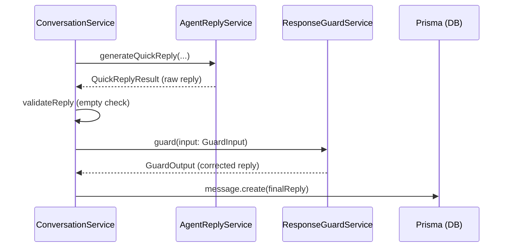

# Design Document: ResponseGuardService

## Overview

The `ResponseGuardService` is a deterministic post-processing layer that intercepts agent replies after generation (by LLM or local rules) and before persistence/delivery. It applies a prioritized set of text transformation rules to fix known problematic patterns without modifying the LLM, prompts, or existing service architecture.

The service is a pure function — no LLM calls, no database access, no side effects. It receives a `GuardInput` containing the reply, user message, conversation state, and known facts, and returns a `GuardOutput` with the (potentially modified) reply, a `changed` flag, and an optional `guardReason`.

**Key Design Decisions:**
- Pure deterministic logic — testable without mocks
- Single integration point in `ConversationService.handleInboundMessage()` (replacing inline `sanitizeReply`)
- Rule priority is explicit and conflict resolution is well-defined
- Segment-specific contextual templates for handoff replacement

## Architecture



The `ResponseGuardService` sits between reply validation and message persistence. It replaces the existing `sanitizeReply` private method in `ConversationService`.

**Integration constraint:** Only `ConversationService` is modified — a single method call is added after step 9 (validate reply) and before step 10 (save assistant message). No other services are touched.

## Components and Interfaces

### GuardInput

```typescript
export interface GuardInput {
  reply: string;                    // The generated reply to guard
  userMessage: string;              // The user's last message
  segment: string | null;           // Known business segment
  mainPain: string | null;          // Known main pain point
  volume: string | null;            // Known message volume
  handoffOffered: boolean;          // Handoff was previously offered
  handoffAccepted: boolean;         // Client accepted handoff
  handoffCompleted: boolean;        // Handoff already completed
  priceAskedCount: number;          // Times price was asked
  pricingRangeEnabled: boolean;     // Whether agent has configured pricing
  startingPrice: string | null;     // Configured starting price (e.g., "R$399/mês")
  conversationHistory: Array<{      // Previous messages (for IA explanation check)
    role: 'user' | 'assistant';
    content: string;
  }>;
}
```

### GuardOutput

```typescript
export interface GuardOutput {
  reply: string;                    // The final (potentially modified) reply
  changed: boolean;                 // Whether any rule modified the reply
  guardReason: string | null;       // Which rule(s) fired (null if unchanged)
}
```

### ResponseGuardService

```typescript
@Injectable()
export class ResponseGuardService {
  guard(input: GuardInput): GuardOutput;
}
```

### Rule Engine Architecture

The service processes rules in strict priority order. Each rule is a pure function:

```typescript
interface GuardRule {
  name: string;
  priority: number;
  type: 'full-replace' | 'partial-transform';
  applies(input: GuardInput, currentReply: string): boolean;
  apply(input: GuardInput, currentReply: string): string;
}
```

**Rule priority (highest first):**

| Priority | Rule | Type | Description |
|----------|------|------|-------------|
| 1 | Rule 2: Handoff Completed | full-replace | Always respond with fixed post-handoff message |
| 2 | Rule 4: Frustrated Price | full-replace | Direct safe price response for frustrated clients |
| 3 | Rule 1: Isolated Handoff | full-replace | Replace bare handoff offers with contextual version |
| 4 | Rule 3: Price Response Fix | full-replace | Fix evasive price-blocking replies |
| 5 | Rule 5: Broken Phrases | partial-transform | Fix corrupted/broken text fragments |
| 6 | Rule 6: IA Explanation | partial-transform | Limit IA explanation to 1x per conversation |
| 7 | Rule 7: Block Premature Handoff | metadata-only | Prevent state escalation without acceptance |

**Conflict resolution:**
- Once a `full-replace` rule fires, subsequent `full-replace` rules are skipped
- `partial-transform` rules always run (they modify fragments, not the entire reply)
- `metadata-only` rules don't modify the reply text at all

### Segment Template Map

```typescript
const SEGMENT_TEMPLATES: Record<string, string> = {
  'clinica': 'Com o volume de agendamentos e as dúvidas repetidas que vocês recebem, faz sentido a equipe avaliar o melhor caminho. Quer que eu encaminhe?',
  'etiqueta': 'Com esse fluxo de orçamentos e a necessidade de padrão nas respostas, faz sentido a equipe avaliar. Quer que eu encaminhe?',
  'restaurante': 'Com o volume de pedidos no horário de pico e as perguntas repetidas, faz sentido a equipe avaliar o melhor caminho. Quer que eu encaminhe?',
  'academia': 'Com as dúvidas sobre planos e horários chegando o tempo todo, faz sentido a equipe avaliar. Quer que eu encaminhe?',
  'contabil': 'Com o volume de solicitações e prazos para gerenciar, faz sentido a equipe avaliar o melhor caminho. Quer que eu encaminhe?',
  'fallback': 'Pelo que você descreveu, faz sentido a equipe avaliar o melhor caminho para o seu caso. Quer que eu encaminhe?',
};
```

Segment matching uses `includes()` on the lowercased segment string with aliases:
- `clinica`, `clínica` → clinica template
- `etiqueta`, `fábrica`, `fabrica` → etiqueta template
- `restaurante` → restaurante template
- `academia`, `fitness` → academia template
- `contabil`, `escritório`, `escritorio` → contabil template
- Everything else → fallback template

### Detection Functions

**Isolated Handoff Detection:**
- Reply is < 60 characters
- Contains a handoff question pattern (e.g., "encaminhar?", "encaminhe?", "seguir?", "interessa?")
- Does NOT contain contextual preamble (segment-related words, pain references, or scenario summary)

**Price Keyword Detection (user message):**
- Matches: `preço`, `preco`, `valor`, `custa`, `custo`, `orçamento`, `orcamento`, `faixa`

**Price-Blocking Detection (reply):**
- Matches: "Não trabalho com valores", "Não trabalho com faixas", "não posso informar", "não consigo informar", "prefiro que a equipe"

**Frustration-About-Price Detection (user message):**
- Matches: "só me diz quanto custa", "não tenho tempo", "não quero contar minha vida", "me dá uma faixa", "quero saber o preço mesmo", "me passa logo", "direto ao ponto"

**Acceptance Phrase Detection (user message):**
- Matches: "sim", "pode", "pode encaminhar", "sim pode encaminhar", "tá bom manda", "ta bom manda", "quero proposta", "manda", "ok", "quero sim"

**IA Explanation Detection:**
- Partial match on: "A IA responde com base em regras, base de conhecimento e limites definidos"

## Data Models

No new database models are needed. The service operates entirely on in-memory data passed through `GuardInput`.

The service will be registered in `AgentModule` as a provider and exported for use by `ConversationService` (via `ConversationModule` imports).

## Correctness Properties

*A property is a characteristic or behavior that should hold true across all valid executions of a system — essentially, a formal statement about what the system should do. Properties serve as the bridge between human-readable specifications and machine-verifiable correctness guarantees.*

### Property 1: Isolated handoff always replaced with contextual response

*For any* reply that is detected as an isolated handoff (short, question-form, no contextual preamble) and *for any* Known_Facts segment, the guard output reply SHALL contain segment-relevant context (matching the segment template or fallback) and SHALL NOT equal the original isolated handoff phrase.

**Validates: Requirements 1.1, 1.7, 1.8**

### Property 2: Handoff completed always produces fixed response

*For any* GuardInput where `handoffCompleted` is true and the user message matches an acceptance/acknowledgment phrase, the guard output reply SHALL always be exactly "Seu atendimento já foi encaminhado para a equipe da Decodifica com o resumo do cenário." regardless of the input reply content or any other conditions.

**Validates: Requirements 2.1, 2.3**

### Property 3: Price-blocking reply replaced with safe response

*For any* GuardInput where the user message contains a price keyword AND the reply contains a price-blocking phrase, the guard output reply SHALL be the Safe_Price_Response and SHALL NOT contain the original price-blocking phrase.

**Validates: Requirements 3.1, 3.4**

### Property 4: Frustrated price always overrides reply

*For any* GuardInput where the user message matches a frustration-about-price pattern, the guard output reply SHALL be the Safe_Price_Response regardless of the original reply content.

**Validates: Requirements 4.1, 4.3**

### Property 5: No exclamation marks survive

*For any* GuardInput, the guard output reply SHALL NOT contain any exclamation mark characters. Every `!` in the input reply SHALL be replaced with `.` in the output.

**Validates: Requirements 5.6**

### Property 6: IA explanation appears at most once per conversation

*For any* GuardInput where the reply contains the IA_Explanation_Phrase AND `conversationHistory` already contains an assistant message with that phrase, the guard output reply SHALL contain the short alternative ("A ideia é automatizar o que é repetitivo e encaminhar para humano quando o atendimento exigir mais cuidado.") instead of the long explanation. Conversely, *for any* GuardInput where the history does NOT contain the phrase, it SHALL be preserved unchanged.

**Validates: Requirements 6.1, 6.2**

### Property 7: No state escalation without explicit acceptance

*For any* GuardInput where `handoffAccepted` is false AND the reply only offers handoff (without confirmation language), the guard SHALL NOT produce output that would enable a transition to "chamar_humano" status.

**Validates: Requirements 7.1, 7.2**

### Property 8: Output contract invariant

*For any* GuardInput, the guard output SHALL satisfy: `changed === (output.reply !== input.reply)` AND `(changed === true) implies (guardReason !== null)` AND `(changed === false) implies (guardReason === null)`.

**Validates: Requirements 8.2, 8.3, 8.4**

### Property 9: Rule priority determinism

*For any* GuardInput that triggers multiple full-replace rules, the highest-priority rule's replacement SHALL be the final output. Non-conflicting partial-transform rules (like exclamation removal) SHALL still apply to the result of the highest-priority full-replace rule.

**Validates: Requirements 9.1, 9.2, 9.3**

## Error Handling

The `ResponseGuardService` is designed to be infallible:

1. **No exceptions thrown** — all detection functions use safe string operations (`includes`, regex with try/catch)
2. **Null/undefined safety** — all optional fields in `GuardInput` are handled with nullish coalescing
3. **Empty reply passthrough** — if the input reply is empty, the guard returns it unchanged (empty handling is done upstream)
4. **Malformed history** — if `conversationHistory` is empty or malformed, Rule 6 defaults to "first occurrence" behavior (preserves the phrase)
5. **Unknown segment** — always falls back to the generic template (never throws)

If any rule's detection or application logic encounters an unexpected error (defensive programming), that rule is skipped and processing continues with the next rule. The `guardReason` will note which rules succeeded.

## Testing Strategy

### Test Framework

- **Unit tests**: Jest (existing project framework)
- **Property-based tests**: `fast-check` library for TypeScript
- Test file: `apps/api/src/agent/response-guard.service.spec.ts`

### Unit Tests (Example-Based)

Cover specific cases for each rule:
- Each segment template mapping (Requirements 1.2–1.6)
- Each specific acceptance phrase (Requirement 2.2)
- Each specific price-blocking phrase (Requirement 3.4)
- Each frustration phrase (Requirement 4.2)
- Each broken phrase correction (Requirements 5.1–5.5)
- IA explanation substring detection (Requirement 6.3)
- Service interface contract (Requirements 8.1, 8.5, 8.6, 8.7)

### Property-Based Tests

Each correctness property from the design maps to a `fast-check` property test with minimum 100 iterations:

| Property | Generator Strategy |
|----------|-------------------|
| P1: Isolated handoff | Generate short (<60 char) question strings with handoff words + random segments |
| P2: Handoff completed | Generate random acceptance phrases + random reply content, handoffCompleted=true |
| P3: Price blocking | Generate user messages with price keywords + replies with blocking phrases |
| P4: Frustrated price | Generate frustration phrases + arbitrary reply content |
| P5: No exclamation marks | Generate arbitrary reply strings containing 1+ exclamation marks |
| P6: IA explanation max 1x | Generate replies with IA phrase + histories with/without prior use |
| P7: No premature escalation | Generate handoff-offering replies with handoffAccepted=false |
| P8: Output contract | Generate arbitrary GuardInput objects, verify invariant |
| P9: Priority determinism | Generate inputs triggering 2+ rules simultaneously |

**Configuration:**
- Minimum 100 iterations per property
- Tag format: `Feature: response-guard-service, Property {N}: {title}`

### Integration Test

One integration test verifying `ConversationService` calls the guard in the correct position (after reply generation, before save).
