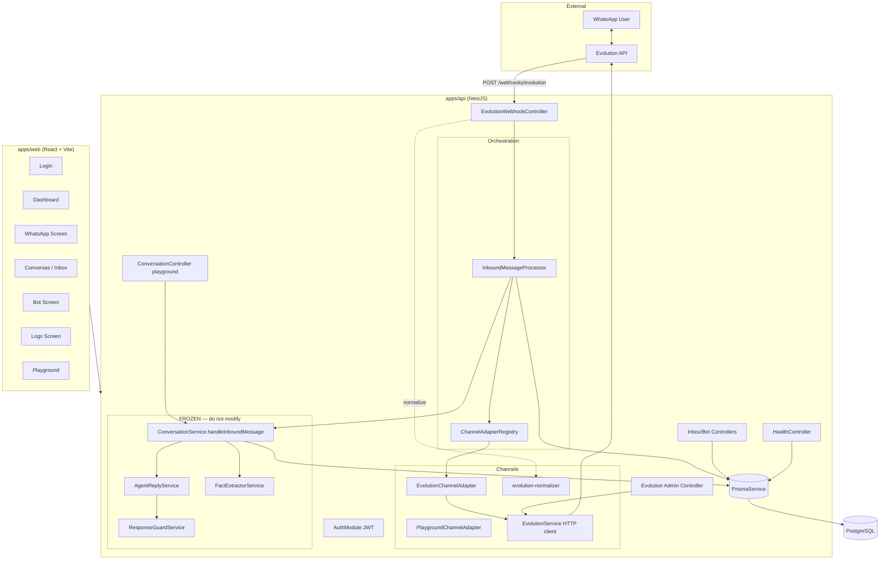
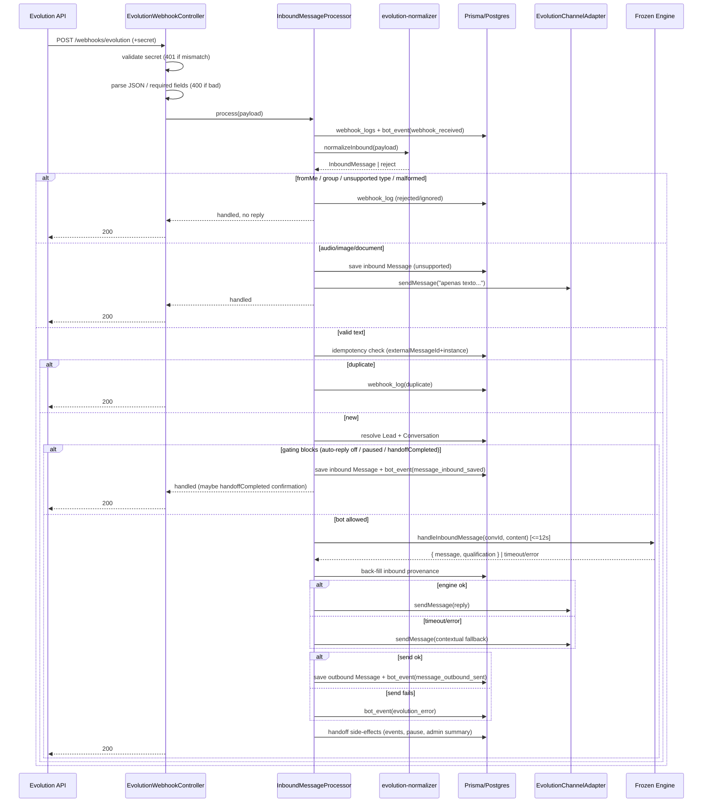
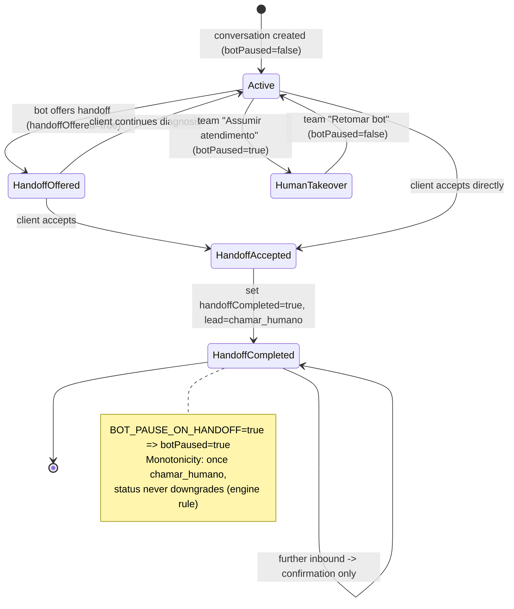

# Design Document: WhatsApp Evolution Production Integration

## Overview

This feature connects the existing, **frozen** DecodificaIA conversational engine to real WhatsApp traffic through the Evolution API and prepares the application for production deployment on EasyPanel. It is a production-integration effort, not a rewrite: the agent engine entrypoint (`ConversationService.handleInboundMessage`) and all of its collaborators (`AgentReplyService`, `AgentAnalysisService`, `ResponseGuardService`, `FactExtractorService`, `score-calculator`, prompts) keep their current behavior unchanged.

The design introduces five concerns layered around the frozen engine:

1. **Channel abstraction evolution** — a finalized `ChannelAdapter` interface with `sendMessage(params)` and `normalizeInbound(payload)`, plus an adapter registry so Playground and WhatsApp coexist without the engine knowing the channel.
2. **Evolution module** — an isolated module (`apps/api/src/modules/channels/evolution`) holding the HTTP client, webhook controller, adapter, normalizer, and types.
3. **Inbound orchestration** — a new `InboundMessageProcessor` that performs idempotency, lead/conversation resolution, bot gating, timeout/fallback, and outbound delivery, then *delegates the conversational turn to the frozen engine*.
4. **Operational dashboard + auth** — new screens (WhatsApp, Conversas/Inbox, Conversation detail, Bot, Logs, Login), JWT auth with `admin`/`atendente` roles, configurable pricing, health/admin endpoints.
5. **Deployment** — docker-compose (api, web, postgres, optional redis), healthchecks, `GET /health`, and EasyPanel env documentation.

### Key Design Principles

- **Engine immutability.** The orchestration layer wraps the engine; it never edits its conversational logic. The single permitted touchpoint is *configuration wiring* of `Pricing_Config` into the already-existing `GuardInput.pricingRangeEnabled` / `GuardInput.startingPrice` fields (see [Configurable Pricing](#configurable-pricing-wiring)).
- **Channel independence.** The engine receives only `(conversationId, content)` exactly as today. All WhatsApp-specific concerns live in the orchestration and Evolution layers.
- **Playground preservation.** The Playground HTTP request/response flow is untouched. Its adapter's `sendMessage` remains a no-op; replies are still returned via the HTTP response of `POST /playground/conversations/:id/messages`.
- **Webhook resilience.** Evolution send failures never surface as HTTP 500 to Evolution; the webhook returns 200 after persisting state.

---

## Architecture

### High-Level Architecture



### The Two Channel Flows

**Playground flow (unchanged):** `POST /playground/conversations/:id/messages` → `ConversationService.handleInboundMessage` → returns `{ message, qualification }` synchronously in the HTTP response. `PlaygroundChannelAdapter.sendMessage` stays a no-op. The observable outcome is identical before and after this feature.

**WhatsApp flow (new):** `POST /webhooks/evolution` → `EvolutionWebhookController` (secret check) → `InboundMessageProcessor` (normalize → filter → idempotency → resolve lead/conversation → bot gating → invoke engine with timeout → send via `EvolutionService` → persist outbound + logs/events) → HTTP 200.

Both flows funnel the *conversational turn* through the same frozen `handleInboundMessage`.

### Where the Frozen Engine Sits and How It Is Wrapped

`handleInboundMessage(conversationId, content)` already **saves the inbound user message internally** and then generates+saves a reply. This creates a sequencing concern for WhatsApp, which requires idempotency *before* any persistence and explicit gating *before* reply generation. The orchestration layer resolves this as follows:

- **Idempotency runs BEFORE the engine.** The processor checks for an existing `Message` with the same `(externalMessageId, instanceName)`. If found, it stops — the engine is never invoked, so no duplicate user message or reply is created. (Requirement 7)
- **Gating runs BEFORE the engine.** When auto-reply is disabled, the conversation is `botPaused`, or `handoffCompleted`, the processor saves the inbound message *itself* (with WhatsApp provenance fields) and does **not** call `handleInboundMessage`. This keeps the "no automatic reply" guarantee while still persisting the inbound. (Requirements 10.1, 10.2, 10.4)
- **When the bot is allowed to reply**, the processor calls `handleInboundMessage`. The engine saves the user message and returns the reply; the processor then **back-fills WhatsApp provenance** (`externalMessageId`, `instanceName`, `externalChatId`, `messageType`, `rawPayload`) onto the inbound `Message` row the engine just created, and sends the returned reply through the Evolution adapter, saving the outbound `Message` with `deliveryStatus`.

> **Design decision — provenance back-fill vs. engine change.** Because the frozen engine creates the inbound `Message` row without WhatsApp fields, the processor performs a follow-up `message.update` to attach provenance. This avoids editing the engine. The idempotency uniqueness contract is still honored because the dedup check happens before the engine runs and the back-fill sets the unique key atomically right after. To make the back-fill race-free and the idempotency check authoritative, a **partial unique index** on `(externalMessageId, instanceName)` is added at the database level (see [Data Models](#data-models)); a duplicate concurrent webhook that slips past the pre-check fails the unique constraint and is caught and treated as a duplicate (200).

### Channel Abstraction Evolution Strategy

The current interface is:

```ts
sendMessage(to: string, message: string): Promise<void>;
receiveMessage(payload: unknown): Promise<InboundMessage>;
```

The finalized interface (`apps/api/src/channel/channel-adapter.interface.ts`) becomes:

```ts
export type ChannelName = 'playground' | 'whatsapp';

export interface SendMessageParams {
  to: string;                 // conversationId (playground) or phone (whatsapp)
  content: string;
  instanceName?: string;      // whatsapp only
  conversationId?: string;    // for logging/correlation
}

export interface InboundMessage {
  channel: ChannelName;
  instance: string | null;        // null for playground
  externalMessageId: string | null;
  from: string;                   // phone or senderIdentifier
  to: string | null;
  contactName: string | null;
  content: string;
  messageType: 'text' | 'audio' | 'image' | 'document';
  timestamp: Date;
  rawPayload: unknown;
}

export interface ChannelAdapter {
  readonly channel: ChannelName;
  sendMessage(params: SendMessageParams): Promise<void>;
  normalizeInbound(payload: unknown): Promise<InboundMessage>;
}

export const CHANNEL_ADAPTER_REGISTRY = Symbol('CHANNEL_ADAPTER_REGISTRY');
```

**Coexistence via a registry.** `ChannelModule` provides a `ChannelAdapterRegistry` that maps `ChannelName → ChannelAdapter`. Both `PlaygroundChannelAdapter` and `EvolutionChannelAdapter` register themselves by their `channel` property. Consumers resolve an adapter by channel rather than relying on the single `CHANNEL_ADAPTER` token. The legacy `CHANNEL_ADAPTER` token is retired; the Playground controller path does not use `sendMessage` at all (it returns via HTTP), so this change is transparent to it.

**Backward-compatible `InboundMessage` extension.** The richer shape supersets the old one. The Playground adapter is updated to populate `channel: 'playground'`, `from: senderIdentifier`, `content`, `messageType: 'text'`, and nulls for WhatsApp-only fields, plus it preserves `conversationId` resolution via `to`. Because the Playground controller calls `handleInboundMessage` directly with `(id, content)` and never goes through `normalizeInbound`, the Playground's observable behavior is unaffected (Requirement 2.5).

> **Design decision — keep the Playground HTTP request/response flow intact.** WhatsApp is routed through the new adapter shape and the orchestrator; the Playground continues calling the engine directly. The two share the engine, not the transport. This satisfies Requirement 1.2 and 2.5 with zero behavioral change to the Playground.

### Webhook Processing Pipeline



### Handoff State Machine



The engine already enforces score/handoff **monotonicity** (once `chamar_humano`, it stays unless explicit desistance). The orchestration layer reads the engine's returned `qualification.status`/`shouldHandoff` and applies the production side-effects (set `handoffAccepted`/`handoffCompleted`, pause bot, emit events, send admin summary) without altering how the engine decided.

---

## Components and Interfaces

### Module Layout

```
apps/api/src/
  channel/
    channel-adapter.interface.ts        (EVOLVED: SendMessageParams, InboundMessage, ChannelAdapter)
    channel-adapter.registry.ts         (NEW: resolve adapter by channel)
    playground-channel.adapter.ts       (UPDATED: new method shapes, still no-op send)
    channel.module.ts                   (UPDATED: provide registry + both adapters)
  modules/channels/evolution/
    evolution.module.ts                 (NEW)
    evolution.service.ts                (NEW: HTTP client)
    evolution-webhook.controller.ts     (NEW: POST /webhooks/evolution)
    evolution-channel.adapter.ts        (NEW: implements ChannelAdapter, delegates to EvolutionService)
    evolution.types.ts                  (NEW: payload + response types)
    evolution-normalizer.ts             (NEW: raw payload -> InboundMessage)
  inbound/
    inbound-message.processor.ts        (NEW: orchestration; wraps frozen engine)
    inbound.module.ts                   (NEW)
    pricing-config.service.ts           (NEW: reads/persists Pricing_Config)
  auth/
    auth.module.ts, auth.service.ts, auth.controller.ts
    jwt.strategy.ts, jwt-auth.guard.ts, roles.guard.ts, roles.decorator.ts
  inbox/
    inbox.controller.ts, inbox.service.ts   (Conversas, bot control, manual send)
  health/
    health.controller.ts                (GET /health)
  config/
    config.schema.ts (EXTENDED), config.service.ts (EXTENDED)
```

> **Relationship to existing `apps/api/src/channel` stubs.** The current `EvolutionChannelAdapter` stub under `apps/api/src/channel` is **retired**. Its replacement lives in `modules/channels/evolution/evolution-channel.adapter.ts` and is functional. The interface file and Playground adapter remain in `apps/api/src/channel` (evolved), and the `ChannelModule` imports the Evolution adapter from the new module to register it in the registry. The old stub `evolution-channel.adapter.ts` and its spec are deleted.

### EvolutionService (HTTP client)

Performs all calls to Evolution_API. Uses `@nestjs/axios` `HttpService` (or native `fetch`) and `AppConfigService` for credentials. Every method returns a discriminated result so failures never leak the API key.

```ts
export type EvolutionResult<T> =
  | { ok: true; data: T }
  | { ok: false; error: string };   // error message scrubbed of EVOLUTION_API_KEY

@Injectable()
export class EvolutionService {
  sendTextMessage(to: string, text: string): Promise<EvolutionResult<{ externalMessageId: string }>>;
  getInstanceStatus(): Promise<EvolutionResult<InstanceStatus>>;
  connectInstance(): Promise<EvolutionResult<ConnectResult>>;
  getQRCode(): Promise<EvolutionResult<{ base64: string | null }>>;
  restartInstance(): Promise<EvolutionResult<void>>;
  setWebhook(): Promise<EvolutionResult<void>>;        // uses PUBLIC_API_URL + /webhooks/evolution
  logoutInstance(): Promise<EvolutionResult<void>>;
  sendTypingOrPresence(to: string): Promise<EvolutionResult<void>>;  // where supported
}
```

(Requirement 14) All outbound HTTP includes the `apikey` header server-side only (Requirement 18.2). Errors are wrapped: any caught error message has the configured key string replaced with `***` before logging/returning (Requirement 14.3, 18.6).

### EvolutionChannelAdapter

Implements the evolved `ChannelAdapter` (`channel = 'whatsapp'`). `sendMessage(params)` delegates to `EvolutionService.sendTextMessage(params.to, params.content)`. `normalizeInbound(payload)` delegates to `evolution-normalizer`. (Requirements 2.3, 2.4, 6.1)

### evolution-normalizer

Pure function `normalizeInbound(payload): InboundMessage | NormalizationReject`. Extracts Evolution's `data.key.id` (externalMessageId), `data.key.remoteJid`/`fromMe`, `pushName` (contactName), and `data.message` content. Decides `messageType`. Rejects when `externalMessageId`, `from`, or `content` is missing (Requirement 6.2). Flags `fromMe` (6.3), group JIDs ending in `@g.us` (6.4), and types outside `{text,audio,image,document}` (6.5). Pure and deterministic → property-testable.

### EvolutionWebhookController

```ts
@Controller('webhooks/evolution')
export class EvolutionWebhookController {
  @Post()
  @HttpCode(200)
  async receive(@Headers() headers, @Body() body, @Req() req): Promise<WebhookResponse>;
}
```

Order: (1) secret validation → 401 on mismatch, never processes (Requirement 5.2); skip when unconfigured (5.3). (2) JSON/required-field validation → 400 (5.6). (3) delegate to `InboundMessageProcessor`; on unhandled error → 500 (5.7), but Evolution *send* failures are caught inside the processor and yield 200 (9.6). The controller is **not** behind the JWT guard (it is authenticated by the webhook secret).

### InboundMessageProcessor (orchestration)

The heart of the WhatsApp flow. Public method:

```ts
async process(payload: unknown): Promise<ProcessOutcome>;
// ProcessOutcome -> { httpStatus: 200|400, action: 'replied'|'ignored'|'duplicate'|'gated'|'unsupported'|'error' }
```

Internal sequence (mirrors the pipeline diagram): record webhook log + `webhook_received` event → normalize → filter → idempotency → resolve lead/conversation → gating → `invokeEngineWithTimeout` → send reply → persist outbound + events → handoff side-effects.

```ts
private async invokeEngineWithTimeout(conversationId: string, content: string) {
  return Promise.race([
    this.conversationService.handleInboundMessage(conversationId, content),
    timeout(12_000),  // Absolute_Timeout
  ]);
}
```

On timeout/error → `Contextual_Fallback` (Requirement 23). Truncates content to 4000 chars before invoking the engine (6.7/6.8). Resolves lead by phone (8.1/8.2) and conversation by `(leadId, channel=whatsapp, instanceName, status active)` (8.3/8.4). Sets lead name from `contactName` when unset, tolerating failure (8.5/8.6).

### PricingConfigService and the Pricing Wiring Seam {#configurable-pricing-wiring}

`Pricing_Config` is persisted (see Data Models) and read by `PricingConfigService.get()`. The frozen engine currently hardcodes `pricingRangeEnabled: false`, `startingPrice: null` when building `GuardInput`.

> **The one necessary engine touchpoint — justified as configuration wiring.** Requirement 17.3/17.5 require configured pricing to be applied to replies, including active conversations. The `GuardInput` interface **already exposes** `pricingRangeEnabled` and `startingPrice`; only the two hardcoded literals in `conversation.service.ts` must be replaced with values read from `PricingConfigService`. This is **data wiring**, not a change to conversational logic: the guard rules, prompts, scoring, and handoff behavior are untouched. The engine continues to receive `(conversationId, content)`; pricing is injected through the existing, already-present input fields. This is the minimal possible seam and is the only edit to the frozen file.

Mechanically: `ConversationService` gains a constructor dependency on `PricingConfigService` and, when constructing `guardInput`, sets `pricingRangeEnabled: pricing.pricingRangeEnabled` and `startingPrice: pricing.pricingStartingAtText`. No other lines change.

### Auth, Inbox, Bot Control, Health

- **AuthModule** — `@nestjs/jwt` + Passport JWT. `POST /auth/login` (email/password, bcrypt) issues JWT (Requirement 20.1). `JwtAuthGuard` protects dashboard/admin routes (20.2); `RolesGuard` + `@Roles('admin')` enforces admin-only (20.4, 20.5). Evolution admin endpoints (`GET /channels/evolution/status`, `POST /channels/evolution/set-webhook`, `POST /channels/evolution/send-test-message`) are admin-only (21.4).
- **InboxService/Controller** — list conversations with last message + lead state (16.1); conversation detail with full chat + lead panel (16.2/16.3); actions: `assumir` (takeover → botPaused, assignedTo, status), `pausar`/`retomar` bot, `marcar convertido/perdido`, manual send (12, 13, 16.4). Manual send delegates to `EvolutionService.sendTextMessage`, saves outbound Message attributed to team, emits `human_message_sent` (13.2) or `evolution_error` (13.3).
- **HealthController** — `GET /health` (public) returns `{ status, database, evolutionConfigured, llmConfigured }` (21.1–21.3). `database` derived from a `SELECT 1` probe; `evolutionConfigured`/`llmConfigured` from presence of required config.

### Security Controls

- Webhook secret validation (Requirement 18.1, 5.2).
- `EVOLUTION_API_KEY` server-side only; never returned by any endpoint or sent to frontend (18.2). Health reports a boolean `evolutionConfigured`, not the key.
- Payload sanitization before storage (strip control chars, cap stored `rawPayload` size) (18.3).
- Message size cap: inbound text truncated to 4000 (6.7); reject content over the hard cap before storage (18.4).
- **Per-phone rate limit** via an in-memory token-bucket keyed by phone (or Redis when present): N messages per rolling window; excess inbound logged to `webhook_logs` and dropped without engine invocation (18.5).
- Secret-safe logging: a log scrubber replaces the API key and JWT secret with `***` (18.6).
- No mass send: outbound is only ever produced in response to an inbound or an explicit team manual send (18.7).

### Frontend Components

Routing (`App.tsx`) wraps protected routes in an `<AuthGuard>` and adds:

| Route | Page | Hook | Notes |
|-------|------|------|-------|
| `/login` | `LoginPage` | `useAuth` | stores JWT, sets axios `Authorization` header |
| `/` | `PlaygroundPage` | existing | unchanged |
| `/whatsapp` | `WhatsAppPage` | `useWhatsApp` | status, QR, connect/restart/set-webhook (15) |
| `/conversas` | `InboxPage` | `useInbox` | list + detail (16) |
| `/conversas/:id` | `ConversationDetailPage` | `useConversationDetail` | chat + lead panel + actions (16) |
| `/leads/:id` | existing | existing | unchanged |
| `/bot` | `BotPage` | `useBotSettings` | auto-reply toggle, pricing config (17) |
| `/settings` | existing | existing | agent settings |
| `/logs` | `LogsPage` | `useLogs` | webhook_logs + bot_events views (22.2) |

New component dirs follow the existing pattern: `components/whatsapp`, `components/inbox`, `components/bot`, `components/logs`, `components/auth`. `Sidebar.tsx` is updated to the required menu order: Playground, WhatsApp, Conversas, Leads, Bot, Configurações, Logs (15.1). `api/client.ts` gains a request interceptor attaching the JWT and a response interceptor redirecting to `/login` on 401.

> **Inbox update strategy — recommended MVP: polling.** The Inbox and Conversation detail use interval polling (e.g., `useInbox` refetches every 5s; open conversation every 3s) rather than WebSockets. This is the simpler MVP approach, requires no socket infrastructure on EasyPanel, and satisfies Requirement 16.5 ("reflect the updated last message and date") with bounded latency. Message recording is independent of UI refresh, so a failed/missed poll never blocks persistence (16.6). WebSockets are noted as a future enhancement.

---

## Data Models

### Prisma Schema Changes

All additions to existing models are **nullable or defaulted** so the migration is additive and preserves existing Playground data (Requirement 19.6).

**Conversation (extended)** — `channel` already exists.

```prisma
model Conversation {
  // ... existing fields ...
  instanceName     String?   @map("instance_name") @db.VarChar(100)
  externalChatId   String?   @map("external_chat_id") @db.VarChar(100)
  botPaused        Boolean   @default(false) @map("bot_paused")
  assignedTo       String?   @map("assigned_to") @db.Uuid
  handoffOffered   Boolean   @default(false) @map("handoff_offered")
  handoffAccepted  Boolean   @default(false) @map("handoff_accepted")
  handoffCompleted Boolean   @default(false) @map("handoff_completed")
  lastInboundAt    DateTime? @map("last_inbound_at")
  lastOutboundAt   DateTime? @map("last_outbound_at")

  assignee         User?     @relation(fields: [assignedTo], references: [id])
  botEvents        BotEvent[]

  @@index([channel, instanceName, status])
}
```

**Message (extended)**

```prisma
model Message {
  // ... existing fields ...
  externalMessageId String?  @map("external_message_id") @db.VarChar(128)
  externalChatId    String?  @map("external_chat_id") @db.VarChar(100)
  instanceName      String?  @map("instance_name") @db.VarChar(100)
  messageType       String?  @map("message_type") @db.VarChar(20)
  rawPayload        Json?    @map("raw_payload") @db.JsonB
  deliveryStatus    String?  @map("delivery_status") @db.VarChar(20)

  // Idempotency: partial unique index where both keys are present
  @@unique([externalMessageId, instanceName], name: "uq_message_idempotency")
  @@index([externalMessageId, instanceName])
}
```

> The idempotency uniqueness is the **Idempotency_Key** `(externalMessageId, instanceName)`. Because Playground messages have both `NULL`, they do not collide. The migration creates the unique index `WHERE external_message_id IS NOT NULL AND instance_name IS NOT NULL` (raw SQL in the migration) so it constrains only WhatsApp rows and preserves Playground data. (Requirements 7.1–7.3, 19.6)

**WebhookLog (new)** (Requirement 19.3)

```prisma
model WebhookLog {
  id                String   @id @default(uuid()) @db.Uuid
  provider          String   @db.VarChar(50)
  instanceName      String?  @map("instance_name") @db.VarChar(100)
  eventType         String?  @map("event_type") @db.VarChar(100)
  externalMessageId String?  @map("external_message_id") @db.VarChar(128)
  phone             String?  @db.VarChar(30)
  payload           Json?    @db.JsonB
  processed         Boolean  @default(false)
  error             String?  @db.VarChar(2000)
  createdAt         DateTime @default(now()) @map("created_at")

  @@index([createdAt])
  @@map("webhook_logs")
}
```

**BotEvent (new)** (Requirement 19.4/19.5)

```prisma
model BotEvent {
  id             String   @id @default(uuid()) @db.Uuid
  conversationId String?  @map("conversation_id") @db.Uuid
  leadId         String?  @map("lead_id") @db.Uuid
  type           String   @db.VarChar(50)   // see allowed values below
  payload        Json?    @db.JsonB
  createdAt      DateTime @default(now()) @map("created_at")

  conversation   Conversation? @relation(fields: [conversationId], references: [id])

  @@index([conversationId])
  @@index([type, createdAt])
  @@map("bot_events")
}
```

Allowed `type` values (validated in application code via a TS union, kept as `VarChar` for forward-compat): `webhook_received`, `message_inbound_saved`, `message_outbound_sent`, `bot_paused`, `bot_resumed`, `handoff_requested`, `handoff_completed`, `human_message_sent`, `evolution_error`.

**User (new)** (Requirement 20)

```prisma
model User {
  id           String   @id @default(uuid()) @db.Uuid
  email        String   @unique @db.VarChar(254)
  passwordHash String   @map("password_hash") @db.VarChar(255)
  role         String   @db.VarChar(20)   // 'admin' | 'atendente'
  createdAt    DateTime @default(now()) @map("created_at")
  updatedAt    DateTime @updatedAt @map("updated_at")

  conversations Conversation[]
  @@map("users")
}
```

**PricingConfig / settings persistence (new)** (Requirement 17). A single-row settings table (or reuse a `Settings` key-value model). Chosen: dedicated table for typed access.

```prisma
model PricingConfig {
  id                  String   @id @default(uuid()) @db.Uuid
  pricingRangeEnabled Boolean  @default(true) @map("pricing_range_enabled")
  pricingStartingAt   Decimal  @default(2500) @map("pricing_starting_at") @db.Decimal(12, 2)
  pricingText         String   @map("pricing_text") @db.VarChar(2000)
  updatedAt           DateTime @updatedAt @map("updated_at")

  @@map("pricing_config")
}
```

Seeded with the Requirement 17.2 defaults. `PricingConfigService.get()` returns the row (creating the default if absent), exposing `pricingStartingAtText` (formatted `R$ 2.500`) for the guard's `startingPrice` field.

### Migration Strategy

A single Prisma migration `add_whatsapp_production`:
1. `ALTER TABLE conversations ADD COLUMN ...` (all nullable/defaulted).
2. `ALTER TABLE messages ADD COLUMN ...` (all nullable).
3. `CREATE TABLE webhook_logs / bot_events / users / pricing_config`.
4. Raw SQL: `CREATE UNIQUE INDEX uq_message_idempotency ON messages (external_message_id, instance_name) WHERE external_message_id IS NOT NULL AND instance_name IS NOT NULL;`
5. Seed `pricing_config` defaults and an initial admin `User`.

No existing column is dropped or retyped, so all Playground rows remain valid (19.6).

### Config Schema Extensions

`config.schema.ts` (Joi) gains, with fail-fast validation (Requirement 4):

```ts
EVOLUTION_API_URL: Joi.string().uri().required(),
EVOLUTION_API_KEY: Joi.string().required(),
EVOLUTION_INSTANCE_NAME: Joi.string().required(),
EVOLUTION_WEBHOOK_SECRET: Joi.string().allow('').optional(),
PUBLIC_API_URL: Joi.string().uri().required(),
BOT_AUTO_REPLY_ENABLED: Joi.boolean().truthy('true').falsy('false').default(true),
BOT_PAUSE_ON_HANDOFF:   Joi.boolean().truthy('true').falsy('false').default(true),
ADMIN_WHATSAPP_NUMBERS: Joi.string().allow('').default(''),   // comma-separated
PRICING_RANGE_ENABLED:  Joi.boolean().truthy('true').falsy('false').default(true),
PRICING_STARTING_AT:    Joi.number().min(0).max(999999999.99).default(2500),
PRICING_TEXT:           Joi.string().allow('').optional(),
LLM_PROVIDER:           Joi.string().valid('openrouter', 'openai').default('openrouter'),
OPENROUTER_API_KEY:     Joi.string().when('LLM_PROVIDER', { is: 'openrouter', then: Joi.required() }),
OPENROUTER_BASE_URL:    Joi.string().uri().optional(),
MODEL_NAME:             Joi.string().default('gpt-4o-mini'),
LLM_MODEL_FALLBACK:     Joi.string().default('google/gemini-2.5-flash'),
JWT_SECRET:             Joi.string().min(16).required(),
```

> Joi's `boolean()` with explicit `truthy/falsy` and `convert` rejects values other than `true`/`false` strings, satisfying 4.5; the `.number().min().max()` satisfies 4.6; `.valid('openrouter','openai')` satisfies 4.4; `validationOptions.abortEarly` is currently `false` — to satisfy 4.3 ("halt upon detecting the first such variable" with a name), startup logs validation errors and exits non-zero; the first error's `context.key` is surfaced. `AppConfigService` adds typed getters for each new value (e.g., `evolutionApiUrl`, `botAutoReplyEnabled`, `adminWhatsappNumbers` parsed to `string[]`).

---

## Correctness Properties

*A property is a characteristic or behavior that should hold true across all valid executions of a system — essentially, a formal statement about what the system should do. Properties serve as the bridge between human-readable specifications and machine-verifiable correctness guarantees.*

These properties target the **pure and orchestration logic** introduced by this feature (normalization, filtering, idempotency, gating, truncation, secret/credential safety, handoff transitions, config validation). The frozen engine is treated as a fixed dependency (stubbed/mocked in property tests so input variation exercises the orchestration, not the LLM). UI rendering, Docker/IaC, and external-service behavior are excluded from PBT and covered by example/integration/smoke tests in the Testing Strategy.

### Property 1: Inbound text normalization completeness

*For any* well-formed Evolution text payload, `normalizeInbound` produces an `Inbound_Message` whose `channel` equals `"whatsapp"`, `messageType` equals `"text"`, and whose `externalMessageId`, `from`, and `content` exactly equal the corresponding values extracted from the raw payload.

**Validates: Requirements 2.4, 6.1**

### Property 2: Ineligible inbound never produces a reply

*For any* inbound webhook payload that falls into a rejection category — malformed (missing `externalMessageId`, `from`, or `content`), `fromMe = true`, group-originated (`remoteJid` ending in `@g.us`), or a message type outside `{text, audio, image, document}` — the System records a `Webhook_Log` and produces zero outbound replies.

**Validates: Requirements 6.2, 6.3, 6.4, 6.5**

### Property 3: Unsupported media yields exactly one notice

*For any* inbound message of type `audio`, `image`, or `document`, the System saves exactly one inbound `Message` and sends exactly one outbound text message indicating that only text is supported.

**Validates: Requirements 6.6**

### Property 4: Content truncation boundary

*For any* inbound text content string `c`, the content passed to the Agent_Engine has length `min(len(c), 4000)` and equals the first `min(len(c), 4000)` characters of `c`.

**Validates: Requirements 6.7, 6.8**

### Property 5: Idempotency of webhook processing

*For any* eligible inbound message processed two or more times with the same `(externalMessageId, instanceName)`, the System stores exactly one inbound `Message`, produces at most one outbound reply, records the later deliveries as duplicates in `Webhook_Log`, and responds with HTTP 200 to every delivery.

**Validates: Requirements 7.1, 7.2, 7.3**

### Property 6: Lead and conversation resolution is create-or-reuse

*For any* sequence of inbound WhatsApp messages, the number of Leads created equals the number of distinct sender phone numbers, and for each `(lead, channel="whatsapp", instanceName)` there is at most one active Conversation that is reused across messages.

**Validates: Requirements 8.1, 8.2, 8.3, 8.4**

### Property 7: Contact name assignment

*For any* inbound message carrying a `contactName`, if the resolved Lead's name is unset it becomes the `contactName`, and if the Lead's name is already set it remains unchanged.

**Validates: Requirements 8.5**

### Property 8: Gated conversations save inbound but never auto-reply

*For any* eligible inbound message where automatic reply is suppressed — `BOT_AUTO_REPLY_ENABLED = false` or `Conversation.botPaused = true` — the System saves the inbound `Message` and produces zero automatic replies.

**Validates: Requirements 10.1, 10.2**

### Property 9: Handoff-completed conversations reply only with the confirmation

*For any* inbound message into a Conversation with `handoffCompleted = true` that requires a reply, the only outbound message produced is the fixed confirmation "Seu atendimento já foi encaminhado para a equipe da Decodifica com o resumo do cenário.", and no diagnosis is continued.

**Validates: Requirements 10.4**

### Property 10: Handoff acceptance transition and monotonicity

*For any* conversation in which the client accepts handoff, the System sets Lead status to `chamar_humano`, Lead temperature to `quente`, `Conversation.handoffAccepted = true`, `Conversation.handoffCompleted = true`, sets `botPaused = true` when `BOT_PAUSE_ON_HANDOFF` is true, records both a `handoff_requested` and a `handoff_completed` Bot_Event, and never subsequently downgrades the status away from `chamar_humano`.

**Validates: Requirements 10.3, 11.1, 11.2, 11.3**

### Property 11: Internal handoff summary never reaches the client

*For any* handoff (including the case where the internal summary cannot be generated), no message delivered to the client contains the internal handoff summary content.

**Validates: Requirements 11.6, 11.7**

### Property 12: Internal handoff summary delivered to configured admins

*For any* non-empty configured `ADMIN_WHATSAPP_NUMBERS` list, when a client accepts handoff the System sends exactly one internal summary message to each configured number, each containing telefone, segmento, uso do WhatsApp, dores, volume, sistema citado, resumo, and próximo passo.

**Validates: Requirements 11.5**

### Property 13: Takeover/resume round-trip with events

*For any* Conversation, a takeover sets `botPaused = true`, sets `assignedTo` to the acting Team_Member, sets status to `aguardando_humano` or `chamar_humano`, and records a `bot_paused` Bot_Event; a subsequent resume sets `botPaused = false` and records a `bot_resumed` Bot_Event.

**Validates: Requirements 12.1, 12.2, 12.3, 12.4**

### Property 14: Manual message success path

*For any* manual message sent by a Team_Member that the Evolution_Service confirms, the System delivers the content through the Evolution_Service, saves exactly one outbound `Message` attributed to the team, and records a `human_message_sent` Bot_Event.

**Validates: Requirements 13.1, 13.2**

### Property 15: Manual message failure path

*For any* manual message whose Evolution_Service delivery fails, the System reports the failure to the Team_Member and records an `evolution_error` Bot_Event.

**Validates: Requirements 13.3**

### Property 16: Webhook resilience to send failure

*For any* eligible inbound message where the Evolution_Service send fails, the webhook responds with HTTP 200, records an `evolution_error` Bot_Event, and retains the saved Conversation and inbound `Message`.

**Validates: Requirements 9.6**

### Property 17: Reply-delivery lifecycle and events

*For any* eligible inbound message that the bot is allowed to answer and whose send succeeds, the System saves exactly one outbound `Message`, and records the lifecycle Bot_Events `webhook_received`, `message_inbound_saved`, and `message_outbound_sent` together with a `Webhook_Log` for the event.

**Validates: Requirements 9.2, 9.3, 9.4, 9.5, 22.3, 22.4, 22.5**

### Property 18: Credential safety in outputs and logs

*For any* error, log line, or HTTP response body produced by the System (including Evolution_Service failures and `GET /health`), the configured `EVOLUTION_API_KEY` and `JWT_SECRET` never appear in the output.

**Validates: Requirements 14.3, 18.2, 18.6**

### Property 19: Malformed webhook bodies are rejected with 400

*For any* accepted webhook request whose body is empty, not valid JSON, or missing the fields required to identify an event, the Webhook_Controller responds with HTTP 400 and does not invoke inbound processing.

**Validates: Requirements 5.6**

### Property 20: Webhook secret enforcement

*For any* presented secret that is not an exact match of a configured `EVOLUTION_WEBHOOK_SECRET` (including a missing secret), the Webhook_Controller responds with HTTP 401 and never invokes inbound processing.

**Validates: Requirements 5.2, 18.1**

### Property 21: Payload sanitization before storage

*For any* inbound payload, the persisted representation is sanitized: control characters are removed and stored content is bounded to the configured maximum size.

**Validates: Requirements 18.3**

### Property 22: Per-phone rate limiting

*For any* burst of inbound messages from a single phone number exceeding the configured per-phone limit within the window, the excess messages are recorded but are not passed to the Agent_Engine.

**Validates: Requirements 18.5**

### Property 23: Outbound only in response to inbound

*For any* run of the System, the number of automatically generated outbound WhatsApp messages does not exceed the number of eligible inbound messages that triggered them (no mass or unsolicited sending).

**Validates: Requirements 18.7**

### Property 24: Configured pricing is reflected in price replies

*For any* price-asking inbound message while `pricingRangeEnabled` is true, the produced reply includes the configured `pricingText` and `pricingStartingAt`; and *for any* update to `Pricing_Config`, subsequent replies — including in an already-active conversation — reflect the updated values.

**Validates: Requirements 17.3, 17.5**

### Property 25: Reply timeout and contextual fallback

*For any* engine invocation that exceeds the `Absolute_Timeout` of 12 seconds or fails, the System sends the contextual fallback message (the specified text or an equivalent short contextual message) within a bounded time, persists the error, and exposes no technical error details to the client.

**Validates: Requirements 23.2, 23.3, 23.4**

### Property 26: Authentication and authorization enforcement

*For any* request to a protected Dashboard route or admin endpoint that lacks a valid JWT, the System responds with HTTP 401; and *for any* request bearing a valid `atendente` token to an Admin-only endpoint (including the Evolution administration endpoints), the System responds with HTTP 403.

**Validates: Requirements 20.2, 20.4, 20.5**

### Property 27: Inbox last-message reflection

*For any* sequence of messages recorded on a Conversation, the Inbox listing query returns, for that Conversation, a last message and date equal to the most recently created `Message`.

**Validates: Requirements 16.5**

### Property 28: Per-message structured log completeness

*For any* processed WhatsApp message, the structured log entry contains the keys `conversationId`, `leadId`, `channel`, `phone`, `instanceName`, `usedLocalRule`, `usedLLM`, `usedFallback`, `responseMs`, `llmMs`, `evolutionSendMs`, and `error`.

**Validates: Requirements 22.1**

### Property 29: LLM_PROVIDER validation

*For any* `LLM_PROVIDER` value that is not exactly `openrouter` or `openai`, startup configuration validation fails and reports `LLM_PROVIDER` as the offending variable.

**Validates: Requirements 4.4**

### Property 30: Boolean configuration validation

*For any* value of `BOT_AUTO_REPLY_ENABLED`, `BOT_PAUSE_ON_HANDOFF`, or `PRICING_RANGE_ENABLED` that is neither `true` nor `false`, startup configuration validation fails and reports the offending variable's name.

**Validates: Requirements 4.5**

### Property 31: PRICING_STARTING_AT range validation

*For any* `PRICING_STARTING_AT` value that is non-numeric or outside the inclusive range `[0, 999999999.99]`, startup configuration validation fails and reports `PRICING_STARTING_AT` as invalid; *for any* value inside the range, validation passes.

**Validates: Requirements 4.6**

---

## Error Handling

### Webhook Layer

| Condition | HTTP | Action |
|-----------|------|--------|
| Secret missing/mismatch (when configured) | 401 | Reject, never process (Property 20) |
| Empty/invalid JSON / missing identifiers | 400 | Reject, never process (Property 19) |
| Malformed-but-authenticated payload (normalizer reject) | 200 | `Webhook_Log` rejected, no reply (Property 2) |
| `fromMe` / group / unsupported type | 200 | `Webhook_Log`, no reply (Property 2) |
| Duplicate idempotency key | 200 | `Webhook_Log` duplicate, no reprocess (Property 5) |
| Evolution send failure | 200 | `evolution_error` event, keep state (Property 16) |
| Engine timeout (>12s) or engine error | 200 | Contextual fallback sent, error persisted (Property 25) |
| Unhandled processing error | 500 | Generic failure response (Requirement 5.7) |

### Evolution_Service

All HTTP calls return `EvolutionResult<T>` discriminated unions rather than throwing. Network/HTTP errors are caught, the API key is scrubbed from any message, and `{ ok: false, error }` is returned (Property 18). Callers (adapter, admin controller, manual send) branch on `ok`.

### Engine Invocation

Wrapped in `Promise.race` against a 12s timeout. Both timeout and thrown errors map to the same `Contextual_Fallback` path. The engine's own internal try/catch behavior is unchanged (it already guards lead/conversation updates).

### Lead/Conversation Resolution

`contactName` assignment failures are caught and swallowed so processing continues (Requirement 8.6). Resolution uses a transaction; on a unique-constraint race for the idempotency index, the catch path treats it as a duplicate (200).

### Configuration

Joi validation runs at startup; on failure the process logs the offending variable name(s) and exits non-zero before binding the HTTP port, so no inbound request is ever accepted with invalid config (Requirements 4.3, Properties 29–31).

### Frontend

`api/client.ts` response interceptor maps 401 → redirect to `/login`; 403 → inline "sem permissão" notice; network/5xx → toast with retry. Inbox/detail polling failures are non-fatal and retried on the next interval (Requirement 16.6).

---

## Testing Strategy

### Dual Approach

- **Property-based tests** verify the universal properties above across generated inputs.
- **Unit tests** cover specific examples, edge cases, and error branches.
- **Integration tests** cover external/DB-dependent behavior with 1–3 representative cases.
- **Smoke tests** cover structure, config loading, and deployment artifacts.

### Property-Based Testing

- **Library:** `fast-check` (already the standard choice for the TypeScript/Jest stack in this repo).
- **Iterations:** each property test runs a minimum of **100** iterations (`fc.assert(..., { numRuns: 100 })`).
- **No hand-rolled PBT:** use `fast-check` generators/arbitraries; do not implement property testing from scratch.
- **Tagging:** each property test is tagged with a comment referencing its design property in the format
  `// Feature: whatsapp-evolution-production, Property {number}: {property_text}`.
- **One test per property:** each correctness property is implemented by a single property-based test.
- **Engine isolation:** the frozen `ConversationService.handleInboundMessage` is mocked in orchestration property tests (returning a deterministic `{ message, qualification }` or a configurable delay/throw) so the properties exercise orchestration logic, not the LLM. Prisma is backed by the existing `@prisma/client` mock or an in-memory test double.
- **Generators:** custom arbitraries for raw Evolution payloads (text/media/group/fromMe/malformed variants), phone numbers, content strings of varied length (including >4000), admin-number lists, config values (valid/invalid provider, boolean, numeric range), and message sequences.

Property test files live beside their subjects, e.g. `evolution-normalizer.property.spec.ts`, `inbound-message.processor.property.spec.ts`, `config.schema.property.spec.ts`.

### Unit Tests (examples / edge cases)

- Engine-preservation regression: Playground `POST /playground/conversations/:id/messages` still returns `{ message, qualification }` unchanged (Requirements 1.x, 2.5).
- Config defaults per variable when absent/empty (Requirement 4.2).
- Per-required-variable fail-fast naming (Requirement 4.3, edge cases).
- Secret configured/unconfigured/exact-match branches (Requirements 5.3, 5.4).
- Unhandled error → 500 (Requirement 5.7).
- `contactName` store failure tolerance (Requirement 8.6).
- Inbound-saved-before-engine ordering via spies (Requirement 9.1).
- Pricing insistence follow-up (Requirement 17.4).
- Oversized-beyond-cap rejection (Requirement 18.4).
- Login happy path → JWT → protected access (Requirement 20.1).

### Integration Tests

- `GET /health` reports `database` healthy/unhealthy against a real/mocked connection (Requirements 21.2, 21.3).
- Evolution admin endpoints against a mocked Evolution_API (status/set-webhook/send-test).
- Prisma migration applies cleanly and preserves existing Playground rows (Requirement 19.6).

### Smoke Tests

- Evolution module compiles and all providers resolve (Requirement 3.x).
- `EvolutionService` exposes all required operations (Requirement 14.1).
- Route existence: `POST /webhooks/evolution`, admin endpoints (Requirements 5.1, 21.4).
- `docker-compose config` validates; api + db healthchecks defined; env documentation present (Requirement 24.x).

### Frontend Tests

- Component/snapshot tests for WhatsApp, Inbox, Conversation detail, Bot, Logs, and Login screens (Requirements 15.x, 16.1–16.4, 22.2).
- QR-retrieval graceful failure (Requirement 15.3).
- Sidebar renders the required menu order (Requirement 15.1).

---

## Deployment

### docker-compose Services

```yaml
services:
  api:        # apps/api/Dockerfile; depends_on postgres (healthy); runs migrations on start
  web:        # apps/web/Dockerfile; serves built React app
  postgres:   # postgres:16; volume for data; healthcheck pg_isready
  redis:      # optional; enabled for distributed rate limiting if present
```

### Healthchecks

- **API:** `GET /health` returning `{ status, database, evolutionConfigured, llmConfigured }`; compose healthcheck curls it.
- **Database:** `pg_isready` healthcheck; `api` waits for `postgres` healthy before starting.

### EasyPanel Environment Variables (documented)

`DATABASE_URL`, `APP_ENV`, `FRONTEND_URL`, `PUBLIC_API_URL`, `EVOLUTION_API_URL`, `EVOLUTION_API_KEY`, `EVOLUTION_INSTANCE_NAME`, `EVOLUTION_WEBHOOK_SECRET`, `BOT_AUTO_REPLY_ENABLED`, `BOT_PAUSE_ON_HANDOFF`, `ADMIN_WHATSAPP_NUMBERS`, `PRICING_RANGE_ENABLED`, `PRICING_STARTING_AT`, `PRICING_TEXT`, `LLM_PROVIDER`, `OPENAI_API_KEY`, `OPENROUTER_API_KEY`, `OPENROUTER_BASE_URL`, `MODEL_NAME`, `LLM_MODEL_FALLBACK`, `JWT_SECRET`.

The public webhook URL is derived from `PUBLIC_API_URL` + `/webhooks/evolution` and is what `EvolutionService.setWebhook()` registers with Evolution_API. API domain, frontend domain, and webhook URL are all configured via these env vars (Requirement 24.5), requiring no code changes per environment.
